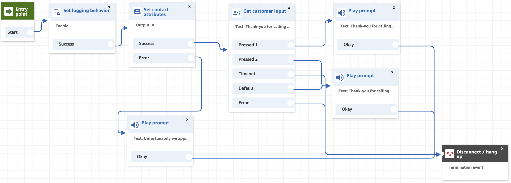

## Overview
If you've been following along, you should now have your Amazon Connect Instance providing a Toll-Free number that people can ring as well as a Contact Flow attached to it that answers incoming calls and plays the caller a message. This is Interesting, but not particularly useful... so what else can we do?

In this section we are going to start adding some additional functionality to our Contact Flows so that we can gain some additional insight and information from the caller. This will take the form of menu selections and contextual information from the users experience (such as their caller ID, number dialed, wether or not they have a private number etc.)

## Next Steps
To get started, proceed to the <b>Adding an IVR</b> section by click the <b>next</b> button below or selecting it from the sidebar on the left.
