## Overview
We start off this phase of the workshop by looking to add a simple IVR (Interactive Voice Response) which is just a fancy way of saying a menu for the caller to select an option from. Yes, that's right... it's "Press 1 for Sales, 2 for Support time".

## Creating a new Contact Flow
To keep things easy we should start off by creating ourselves a new Contact Flow and calling it <b>"Main Incoming"</b>. This will replace our existing <b>"OurFirstFlow"</b> flow from the previous section.

1. Start by creating a new Contact Flow and giving it a name.
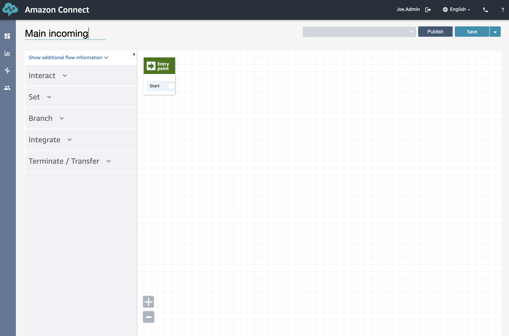

2. Again, but like the previous Contact Flow, go ahead and add a <b>Set logging behavior</b> action and then add a <b>Set contact attributes</b> action, also from the <b>Set</b> group. 
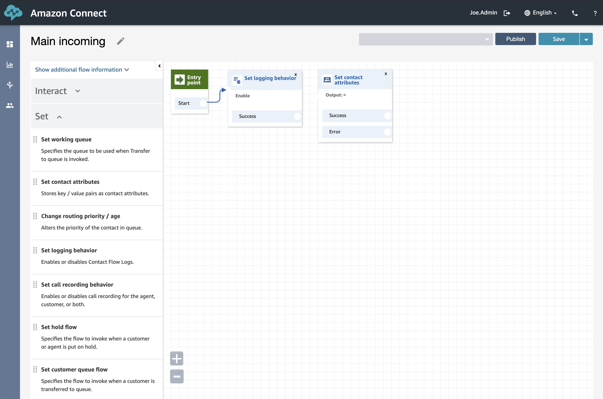

3. Next, we drag a connection between the <b>"Success"</b> output from the <b>"set logging behavior"</b> action to the beginning of the <b>"Set contact attributes"</b>.
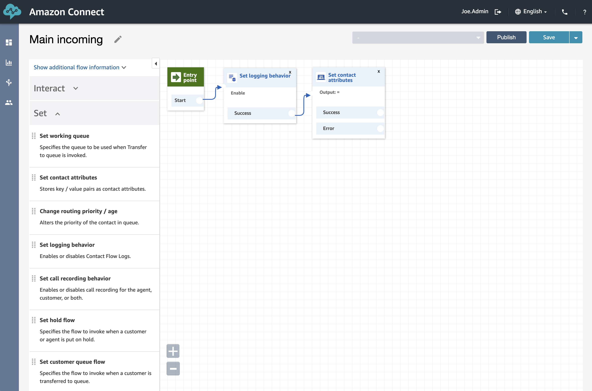

The <b>Set contact attributes</b> action allows us to define variables to the call instance. Examples of this might be things such as:
 - Caller ID
 - the number the caller dialed
 - previously entered values
 - other contextual details

From the <b>Properties</b> window (available by clicking on the action title), you can see we are given the option to define a key and a static value. However, if you click on the <b>"Use attribute"</b> radio button you can instead select available instance values from one of 8 <b>Types</b>, including:
 - System
 - Agent
 - Queue Metrics
 - User Defined
 - External
 - Lex Slots
 - lex Attribtues
 - Media Streams

To get us started, we want to capture the callers phone number and save it to the "CallerId" variable so that we can reference it later and record it in our log stream (which we will cover in the next section).

4. To save our variable, select <b>"System"</b> from the Type menu and <b>"Customer Number"</b> from the Attribute list. Define <b>CallerId</b> under the <b>Destination Key</b> as shown in the screenshot below. Click <b>"Save"</b> once complete. 
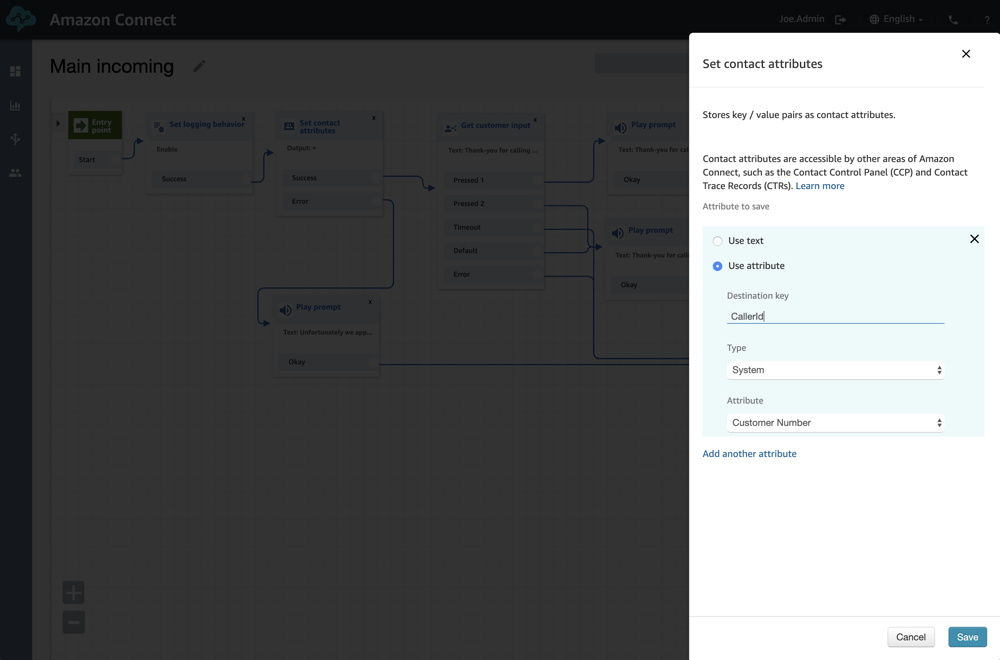
You might have noticed that for the first time, one of the Contact Block we've pulled into our Contact Flow has more than one possible outcome... Our <b>"Set contact attribute"</b> has a "Success" or an "Error" path the call can take. It's important to make sure that you give all possible outcomes a path for the call to follow, so next we're going to add a prompt that informs the caller that an error has occured.

5. Like we've done previously, drag in a <b>"Play Prompt"</b> block from the <b>"Interact"</b> group and place it slightly below the "Set contact attribtue" block... While the location of Contact Blocks on the page is only for UI purposes as we progress you'll see why we place it below and not to the right of the previous block.
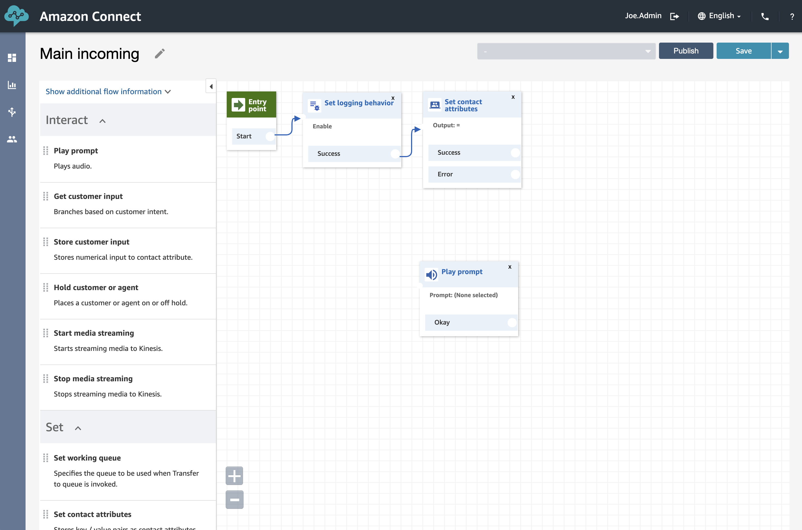

6. Next, just like we've done before go ahead an open the <b>"Properties"</b> of the "Play Prompt" block, select "Text-to-Speech or Chat text" and type an error message that will be read to the user into the <b>"Enter text"</b> field. As shown below, for our example we have simply put in "Unfortunately we appear to be having technical difficulties. Please try your call again later. Goodbye!". While in a Production environment it's advisable to handle error's in a less aggressive way, for the purposes of our Workshop this will be fine.
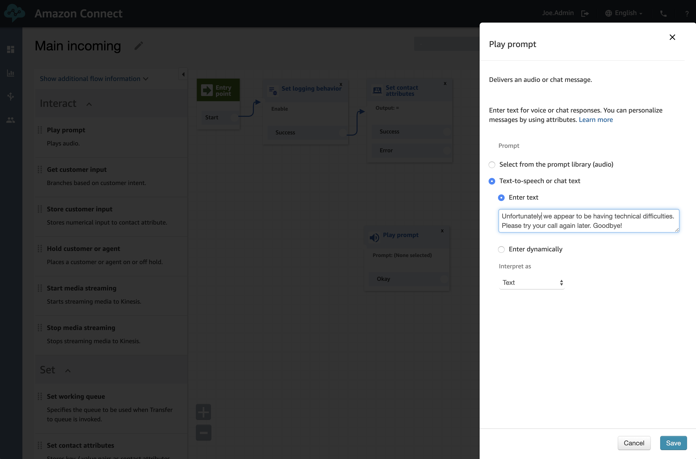

7. Once we've read the caller the error message we then need to end the call. Drag in the <b>"Disconnect/hang up"</b> block from the <b>"Terminate/Transfer"</b> onto the screen.
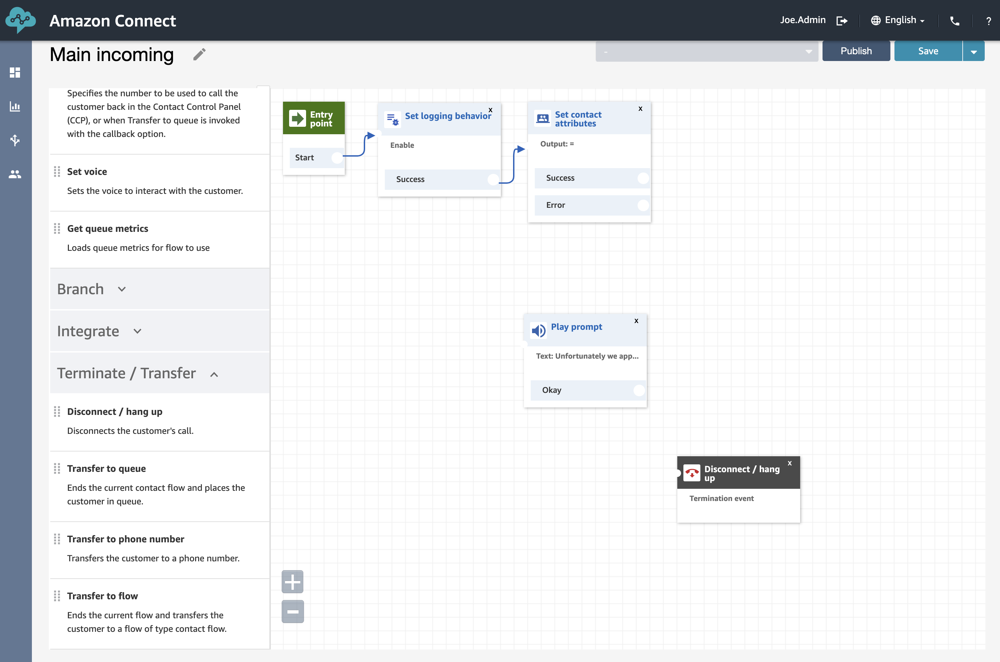

8. We can then link the "Okay" output from our prompt to the "Disconnect/hang up" block similar to the way we did it in the last stage.
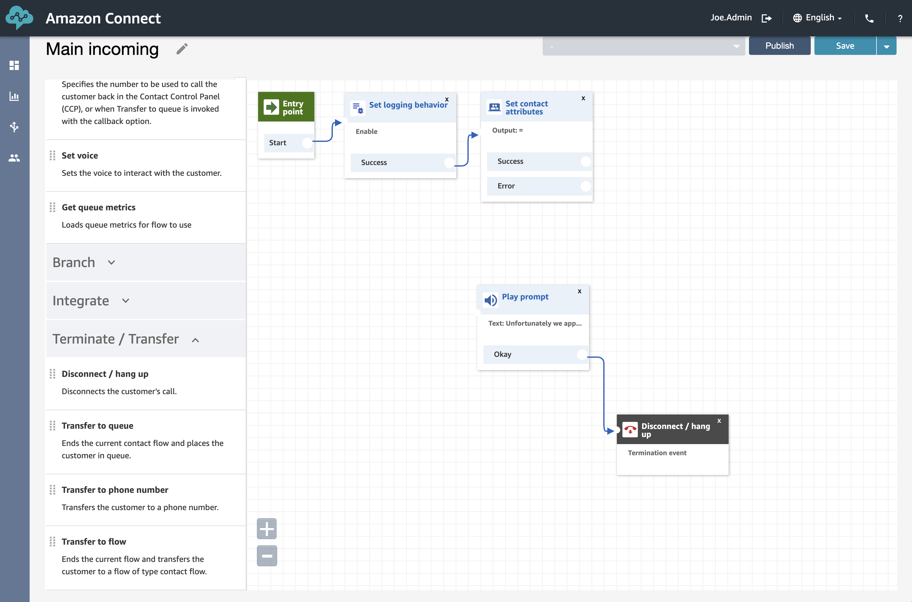

9. Next, we want to link the <b>"Error"</b> from the setting of the Attribute to the Error Message Prompt, giving as an end to end handling of the call when an error occurs. From here we can focus on the other half of the Flow.
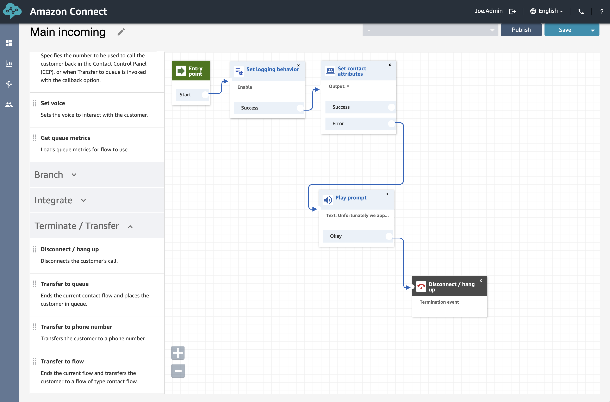
Now we want to have the caller provide us with some information. While Amazon Connect provides us with a number of ways in which we can do this, the easiest is to use the <b>"Get customer input"</b> block. 

10. From the <b>"Interact"</b> group, drag in an instance of the "Get customer input" block and place it to the right of our "Set contact attribute block.
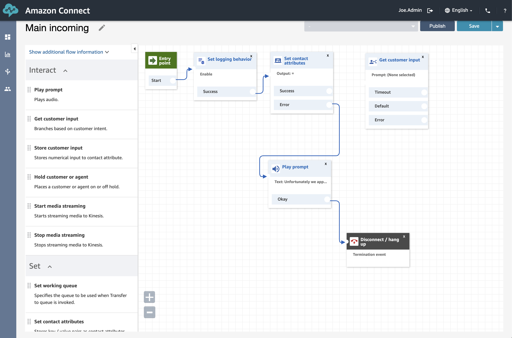

11. Link up the two Contact Blocks, making sure to drag the line from the <b>"Success"</b> outcome and not replacing the <b>"Error"</b> outcome that's flowing to our error prompt.
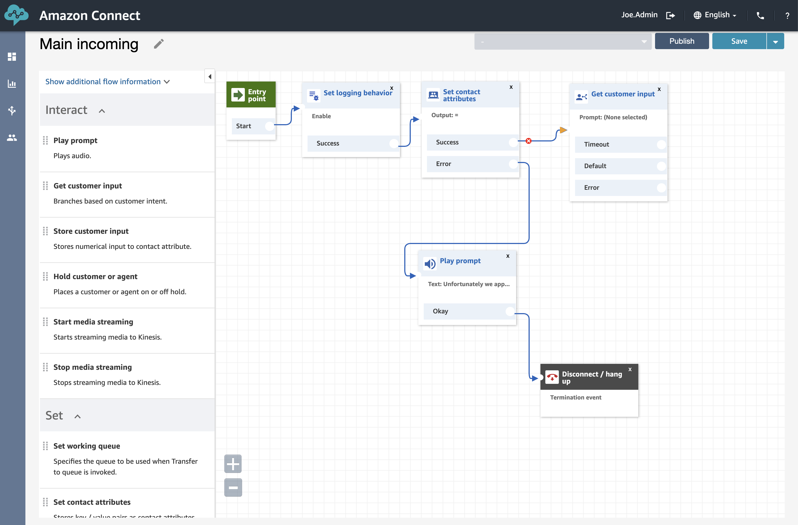
Next we start to craft how we want to interact with our caller. If we open the "Properties" we can see the top half is layed out similar to the "Play Prompt" block in that we can either have it play a previously defined Audit Prompt, or we can use "Text-to-Speech". 

12. After selecting the <b>"Text-to-Speech or chat text"</b> radio button, fo ahead and enter the following text into the <b>"Enter Text"</b> field (replacing %TenantName% with the name you've defined previously). Thank-you for calling %TenantName%. Press 1 for sales. Press 2 for Support. 
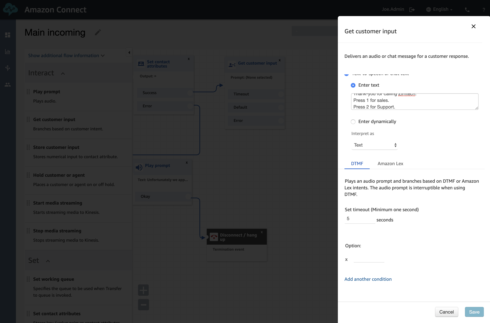
Scrolling down a little further you will notice a copy of new options we've not seen before, a "DTMF" tab and a "Amazon Lex" tab. These two options are the ways in which we can accept the information back from the caller. "DTMF" stands for "dual tone multi frequency" and is just a fancy way of saying "the buttons on your phone... think dialing a menu option like pressing "1" to talk to Sales. "Amazon Lex" Allows us to define a Lex bot so that we can accept voice commands from the caller similar to "Tell us the reason for your call today". From here we can simply handle the Lex slots and intents like we would normally. To start things off we will be using "DTMF" to accept our callers selection and will leverage "Amazon Lex" in a future stage. 

13. From the Text-to-Speech we've already entered you might realise we need to add 2 Options that a caller can select. Under the <b>"Option"</b> field that's already listed, type a "1". Click the <b>"Add another condition"</b> link and type a "2". We can leave the <b>"Set Timeout"</b> at 5 seconds for the time being. Click <b>"Save"</b> once your done.
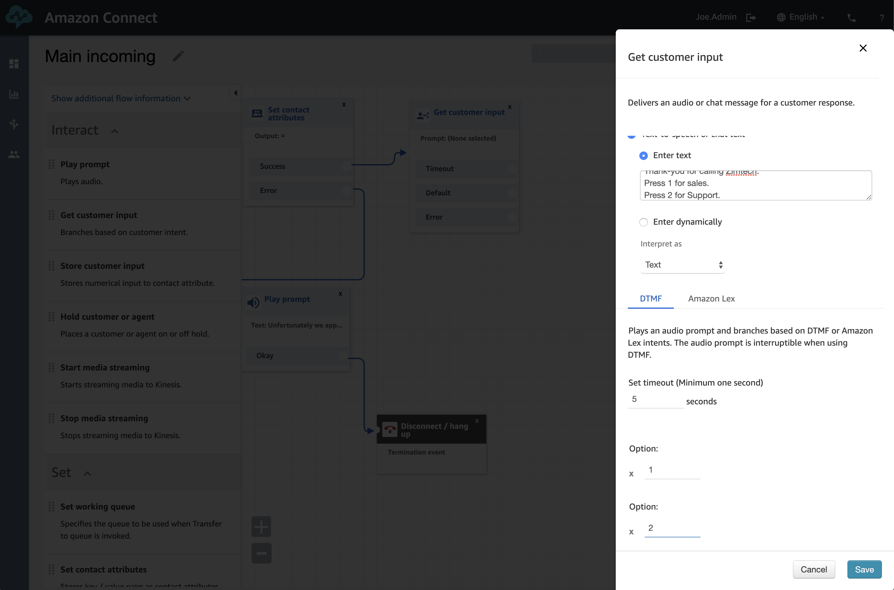

14. So that we can tell if our new Contact Flow is working, we'll need different audio responses for each menu option. Go ahead an drag another "Play Prompt" content block into the designer surface.
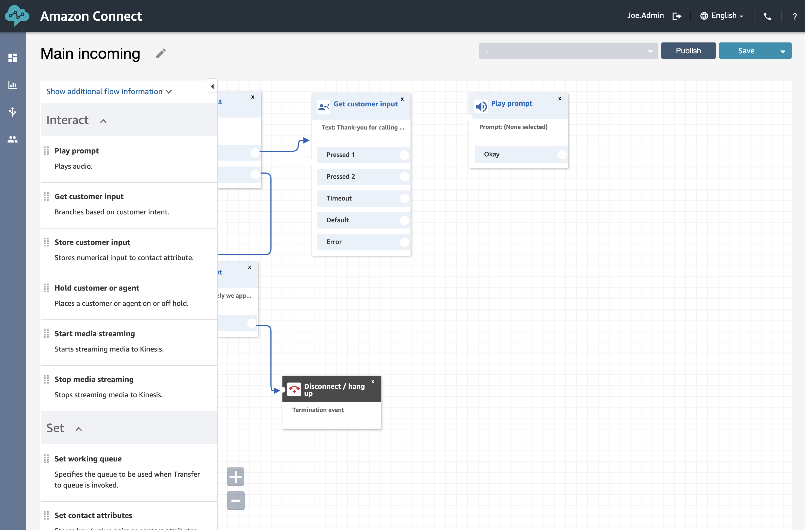

15. using the <b>"Text-to-Speech"</b> option type "Thank-you for calling The ZimTech Sales team. unfortunately everybody is out selling and as such unavailable to take your call at this time" into the <b>"Enter text"</b> box and click <b>"Save"</b> once done.
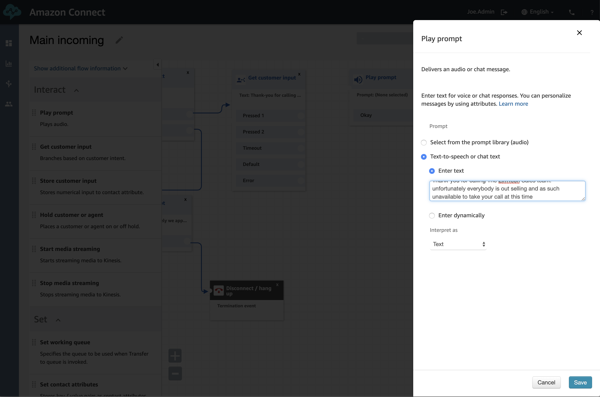
This is where things start to get very powerful. If you take a look at the <b>"Get customer input"</b> Content Block you will see that it has 5 possible outcomes... "Pressed 1", "Pressed 2", "Timeout", "Default" and "Error".

16. to start, let's link tot "Pressed 1" outcome to the "Play Prompt" block we've just created.
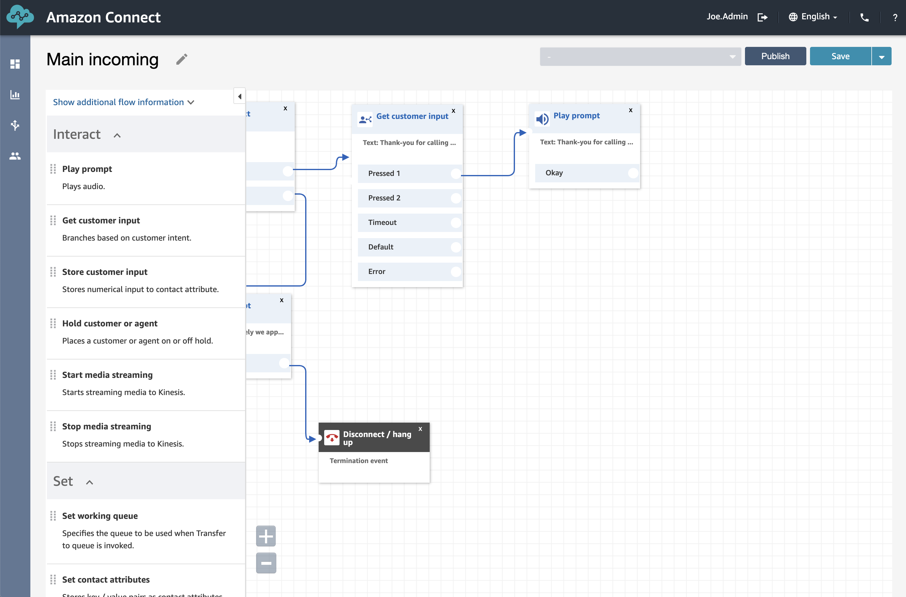

17. Next, repeat the process and create a second "Play Prompt" block with a slightly different message. to add some fun to our workshop, add the following text to the second "Play Prompt" block. "Thank-you for calling support. We are going to hang up on you know so we don't need to fix your issue".
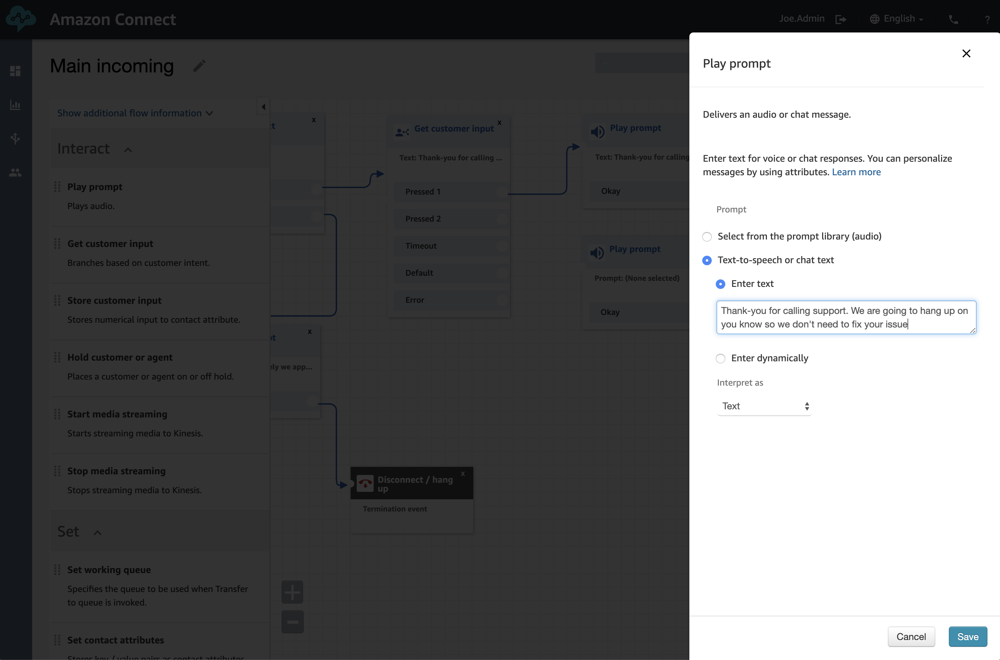

18. We can now link the "Play Prompt" block to the "Pressed 2" outcomes.
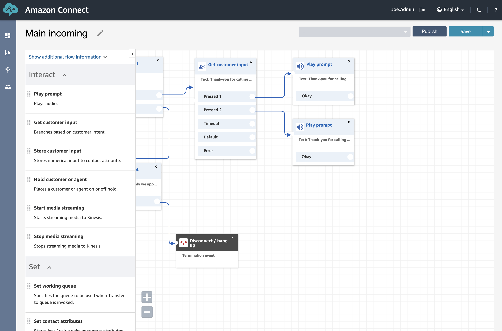
And from here we are almost done... but what about all those other options from the <b>"Get customer Input"</b> block? Well, let's take a closer look at each one:
- <b>Timeout</b>. This is the outcome when a user doesn't select an option within the defined timeout period (which we left as 5 seconds). In a normal solution we might have a loop that re-prompts the user for a selection before directing them to the receptionist, but for our workshop, we'll just have it automatically direct to the "Support" "play Prompt" content Block.
- <b>Default</b>. This is the outcome when a user selects an invalid entry (such as by pressing 5). Much like the Timeout outcome, in a production solution we'd have a loop that informs the user they made an invalid selection and to try again (maybe with a 3 try limit). However for simplicity, we'll also direct this to the "Support" "Play Prompt" block.
- <b>Error</b>. This outcome is triggered for any unexpected reason and much like to the "Set contact attribute" block, we wish to play an error message for the user before hanging up the call.

19. Go ahead an link up the remaining outcomes to their respective blocks, including the "Okay" outcomes of the two "Play Prompts" to the "Disconnect/Hang up" block so that your solution looks like the one below. FINALLY, don't forget to click <b>"Publish"</b> once your done or the new Contact Flow will be unavailable in the next section.

## Next Steps
And that's it, we have successfully created a Contact Flow that accepts a callers input and makes conditional decisions as a result. However, now we need to change the Contact Flow that's linked to our Toll-Free number. We will do that in the next section.