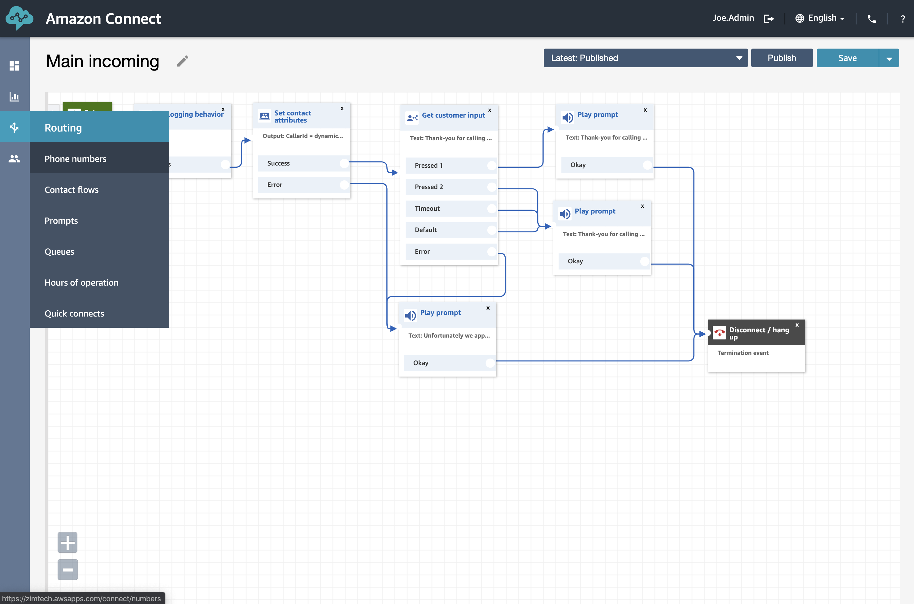
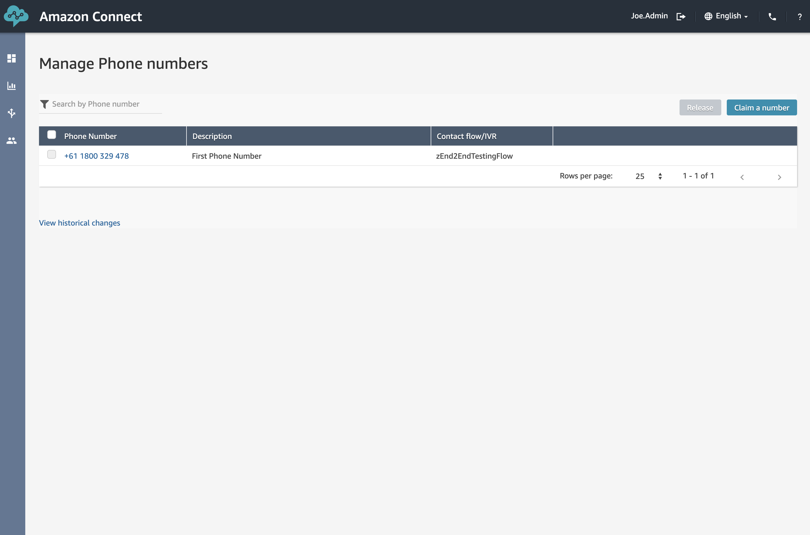
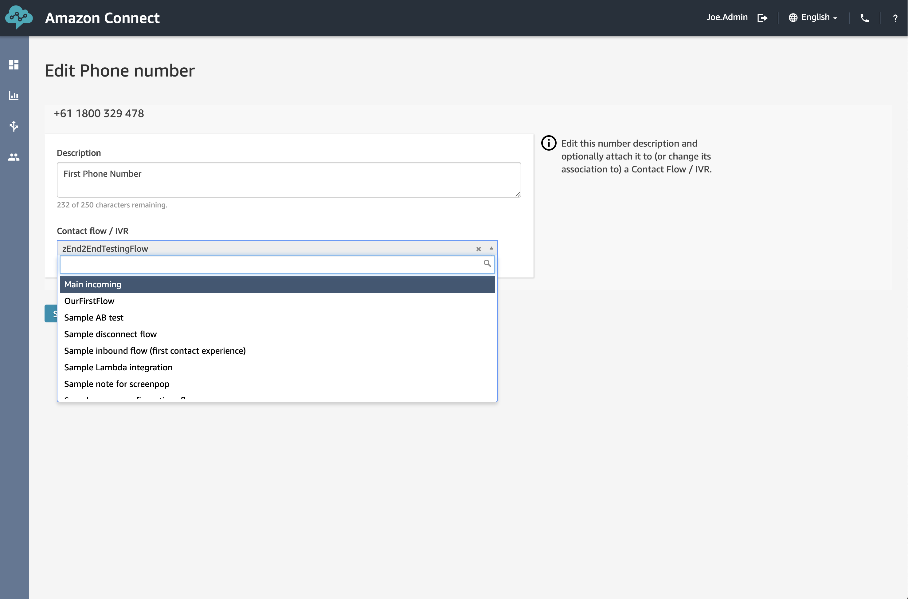
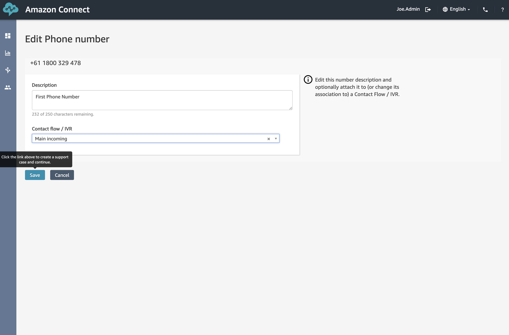

## Overview
We have our phone number and we have our Contact Flow... now it's time to join the two together and tell Connect that whenever our phone number is dialed, it should use our new Contact Flow.

## Routing our calls

1. First things first, we need to  open the <b>"Phone Numbers"</b> page which can be found in the <b>"Routing"</b> menu. 

2. Here we can see a list of all the phone numbers assigned to our Connect Instance. Go ahead and click on the Phone number to open it's settings page.

Here we can see that we are presented with several settings we can change including the Description as well as the "Contact flow / IVR" that's being used.

3. Here we can select the Contact Flow/IVR that it's using. From the drop-down list, select <b>"OurFirstFlow"</b> (or whatever you called it).

4. Click <b>"Save"</b>

5. Make sure that the table lists the correct, new "Contact Flow".

## Next Steps
Next Step is to create a new Contact Flow to handle the incoming calls to your new <b>1800 XXX XXX</b> phone number. Click <b>Create Contact Flow</b> to move onto the next step of tasks.