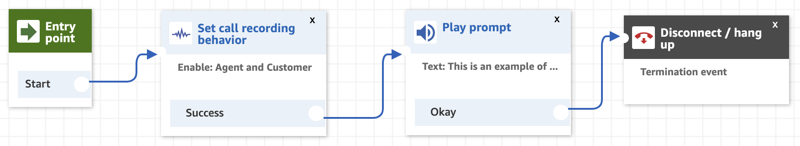

## Overview
In this section we will walk through the process of setting up our our first Direct In-dial Number and connect it to a newly created contact flow so we can start taking phone calls. 

What we will end up with by the end of this section is a <b>1800 XXX XXX</b> phone number that will answer an incoming phone call, and read out a text message before hanging up the call, as shown in the below Contact Flow.

## Next Steps
To get started, proceed to the <b>Configure a new Instance</b> section by click the <b>next</b> button below or selecting it from the sidebar on the left.
