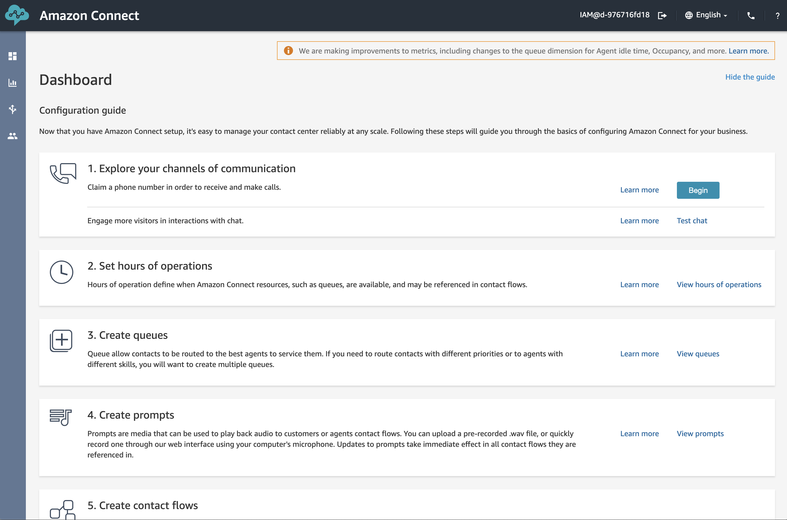
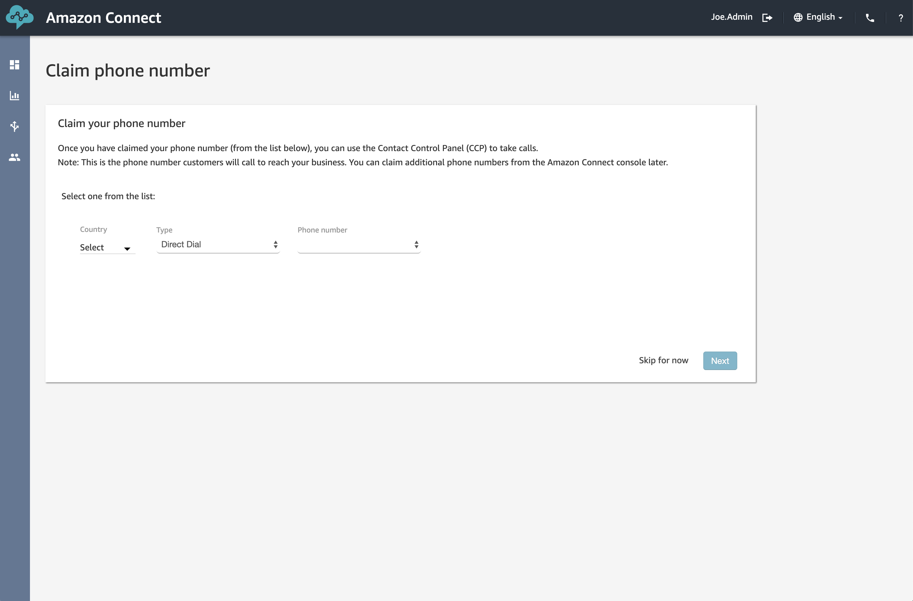
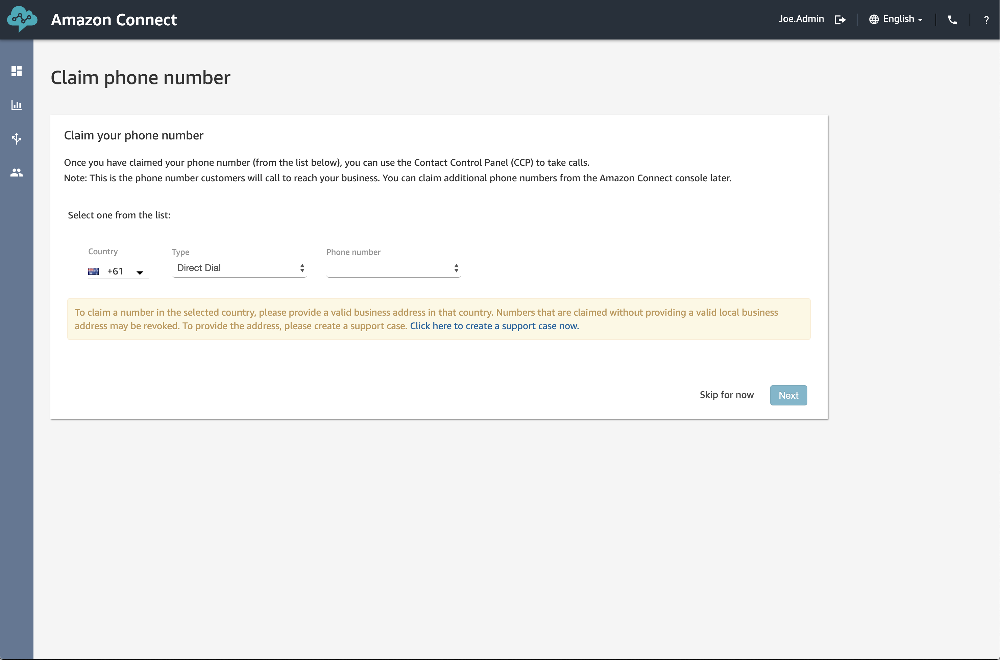
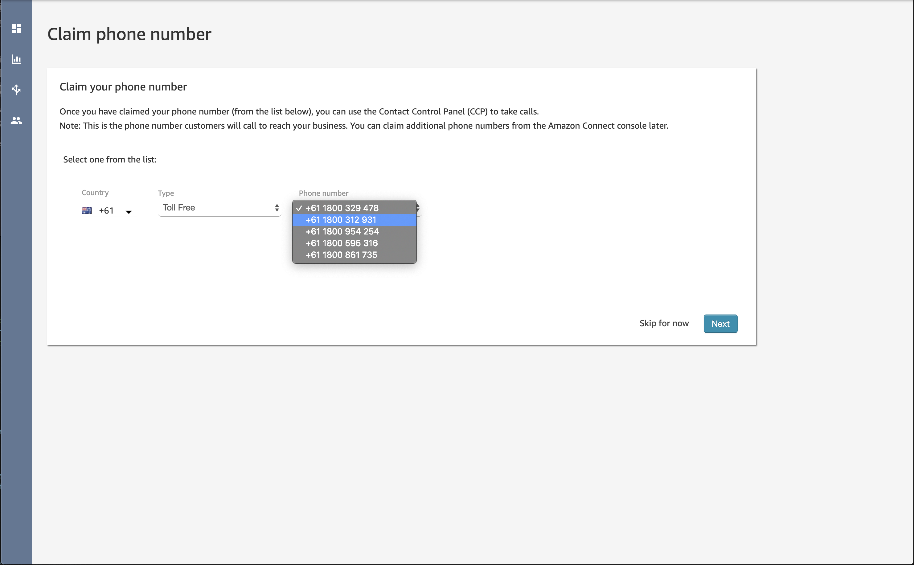
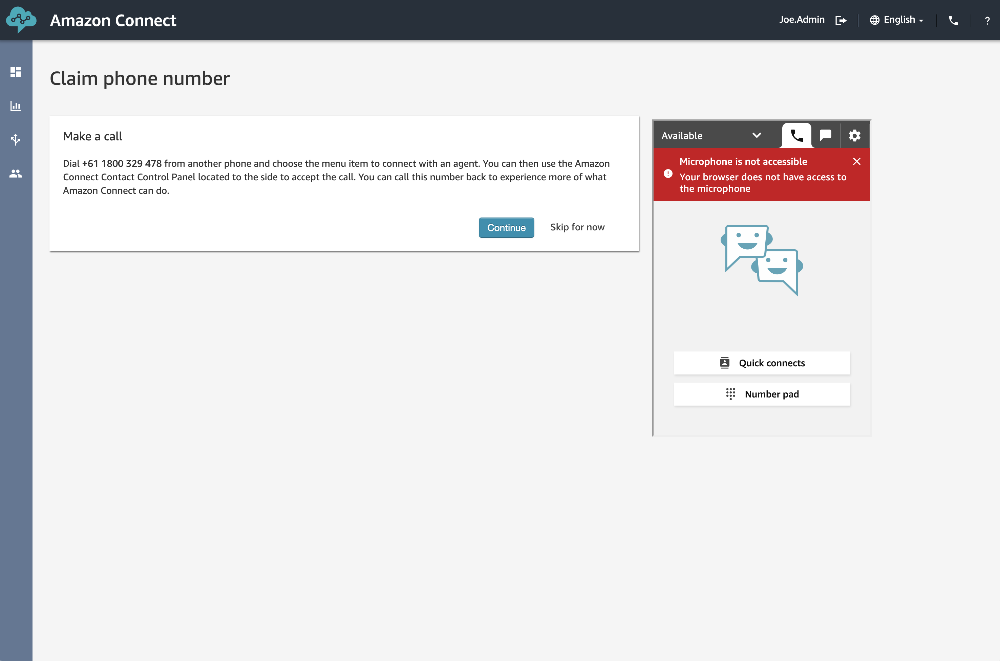

## Overview
Before we can start answering any phone calls, we need to have a phone number that people can ring and that exactly what we're going to address in this section.

## Number Selection
1. Firstly, browse to your Virtual Contact Centre Instance website at <b>https://%InstanceName%/awsapps.com/connect</b> (where our example website is https://zimtech.awsapps.com/connect), login and click the <b>begin</b> button if the "welcome" page appears. From here we can click the <b>"Begin"</b> button under <b>"Exploire your channels of communication"</b> of browse to <b>Phone Numbers</b> under the menu on the left hand side of the page (the icon with three arrows in it).

2. From this page we are able to select a country and type of phone number that we'd like to have allocated to our Instance. For the purposes of the workshop select <b>Australia</b> from the country dropdown list.

There are two types of inbound phone number we can procure from the Amazon Connect Platform:
- <b>Direct Dial</b> These are your typical 02 1234 5678 type phone number are are slightly cheaper to run.
- <b>Tool Free</b> These are your 1800 and 1300 phone numbers.

Where this can get interesting is that in order to get a Direct Dial number, you need to validate your physical address with AWS first. This warning is shown in the screenshot below.

To keep the workshop easy to follow and so we don't all have to wait for Service Requests to be processed you can request the provisioning of a <b>"Toll Free"</b> number.
3. Select <b>"Toll Free"</b> from the <b>Type</b> Drop down. from their you can select any of the provided <b>Phone numbers</b>. Once you've selected an available phone number, click the <b>"Next"</b> button. 

4. From here the wizard will instruct you to dial your new phone number and answer it via the Contact Control Panel. As we are going to assign our own Contact Flow to this phone number, we can go ahead and click the <b>"Skip for now"</b> button available at the bottom of the page (next to the continue button).

## Next Steps
And that's it, we now have our very own <b>1800 XXX XXX</b> number assigned to our Connect Instance. The next step is to create a new Contact Flow to handle the incoming calls to your new phone number. Click <b>Create Contact Flow</b> to move onto the next step of tasks.