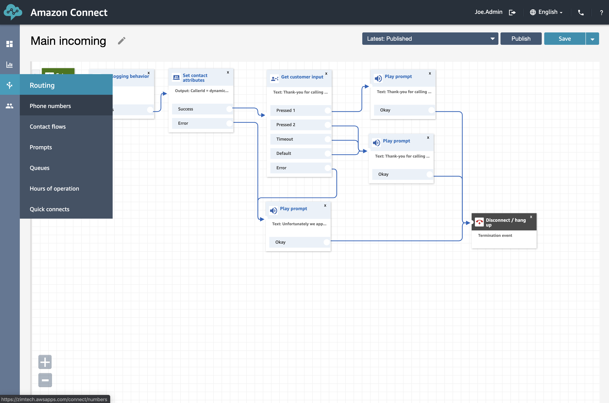
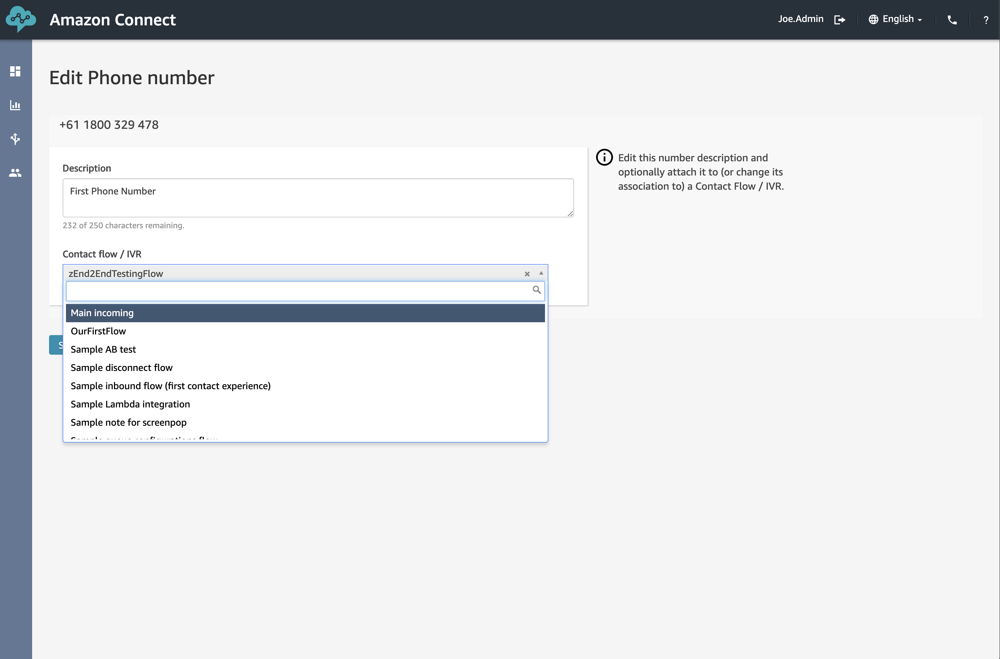
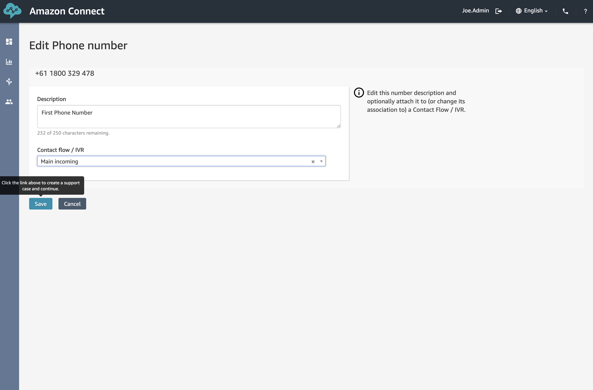
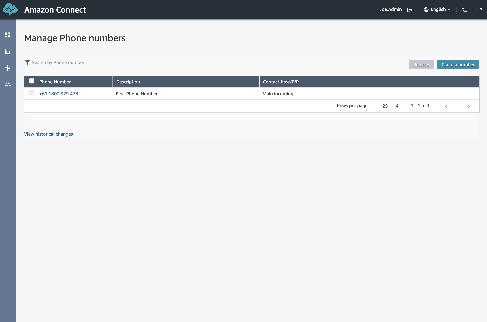

## Overview
Time for us to apply the new Contact Flow to our pre-existing Toll-Free phone number, much like we did in the previous part of the workshop.

## Routing our calls

1. First things first, we need to  open the <b>"Phone Numbers"</b> page which can be found in the <b>"Routing"</b> menu. 

2. Here we can see a list of all the phone numbers assigned to our Connect Instance. Go ahead and click on the Phone number to open it's settings page.

Here we can see that we are presented with several settings we can change including the Description as well as the "Contact flow / IVR" that's being used.

3. Here we can select the Contact Flow/IVR that it's using. From the drop-down list, select <b>"Main Incoming"</b> (or whatever you called it).

4. Click <b>"Save"</b>

5. Make sure that the table lists the correct, new "Contact Flow".

## Next Steps
With our new Contact Flow in place it's time for us to move onto the next phase and test our IVR.