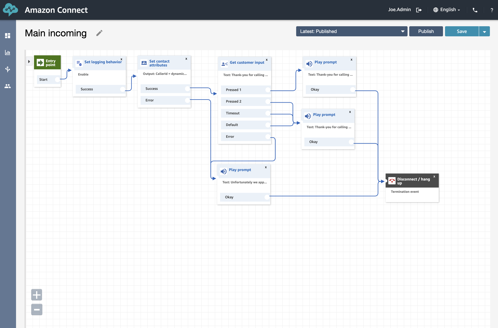

Now we've updated our inbound number with the new Contact Flow it's time for us to test the different outcomes and make sure we are hitting each of the expected outcomes.

This is an interesting process as we can actually see each of the expected paths that a call can make. From the above we can see, the possible outcomes are:
- <b>Press 1</b> results in "Thank-you for calling The ZimTech Sales team. unfortunately everybody is out selling and as such unavailable to take your call at this time"
- <b>Press 2</b> results in "Thank-you for calling support. We are going to hang up on you know so we don't need to fix your issue"
- <b>a Timeout</b> results in "Thank-you for calling support. We are going to hang up on you know so we don't need to fix your issue"
- <b>a Error</b> results in "Thank-you for calling support. We are going to hang up on you know so we don't need to fix your issue"

So, in order for us to test this we need to ring the Toll-Free number once for each of the expected outcomes and validate the results. If you are receiving an unexpected result... you can raise you hand and one of the attendees will come over to assist you.

## Next Steps
Assuming all has gone well you are ready to move into the next section where we will take a look at the logs that are being generated out of the platform. To continue click the <b>"Validate Our Logging"</b> section below or on the sidebar to the left.