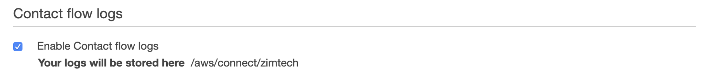
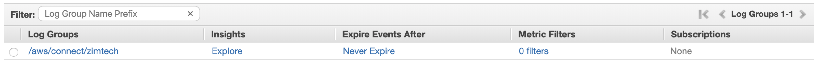
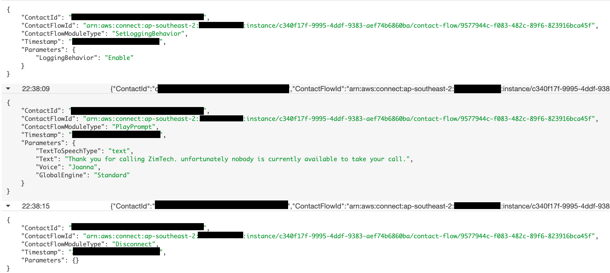
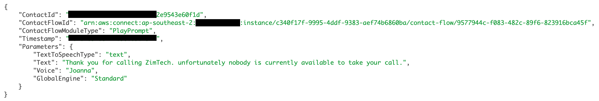
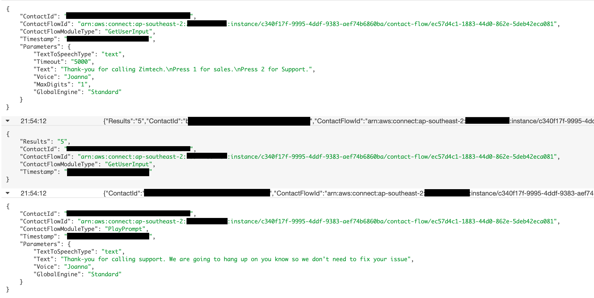

## Overview
The first cab off the rank when it comes to our logging are the <b>"Cloud Watch Logs"</b> which outline each interaction taken by each inbound and/or outbound caller to our Contact Centre Solution.

## Reviewing the Logs
If we cast our minds back to part 1 of this workshop where we originally configured our Contact Centre Solution you might remember that we made sure our Instance had the <b>"Enable Contact Flow Logs</b> checkbox ticked.

by enabling this feature, we also noticed that it created a new <b>Log Group</b> within our CloudWatch Logs section.

Well, if we take a look in that <b>log group</b> now... we will notice that it's been populated with a bunch of information. The exact number of <b>Log Streams</b> you will see will depend on the number of interactions you've had with your contact centre.

If we open up our first Log Stream, we will see three entries.

here we can see the:
- <b>Contact Id</b> a unique identifier for the interaction with Amazon Connect
- <b>ContactFlowModuleType</b> is the Type of Contact Block that was interacted with
- <b>TimeStamp</b>.... it's a timestamp
- <b>Paramaters</b> are any relivant parameters and key value pairs related to the interaction with the content Block.

if we take a closer look at the second entry, we can see a total of four parameters for the "PlayPrompt" Content Block interaction. you can see how this type of information can become very handy not only for troubleshooting, but also for reporting and monitoring the success and failure of your individual options.

## Logs for Interactions
If we open up one of our most recent Log Streams (you may need to browse back to your Log Group) you can see the results of a caller interacting with the IVR we provisioned in the last part of the workshop. In fact we can see each of the 3 steps that where involved with the interaction.

Firstly we can see:
- the Audio being played as a part of the <b>GetUserInput</b> Content Block as well as the parameter outlining the 5000 ms timeout we previously defined.
- The response coming back from the caller which in this case was the digit <b>5</b>.
- Finally, the <b>Play Prompt</b> output for the Support option.... we can see that in this instance, the IVR worked correctly as (if we recall from previous sections) our <b>Default</b> option was configured to automatically forward to the Service Prompt.

As you develop you Amazon Connect Skills, the ability to see the step by step interactions with your contact centre Contact Flow becomes invaluable but from a reporting as well as a diagnosis perspective.

## Next Steps
Logs are all very well and important, but what about some real-time metric. In the next section we can take a look at some of the Cloud Watch Metrics available for consumption.
