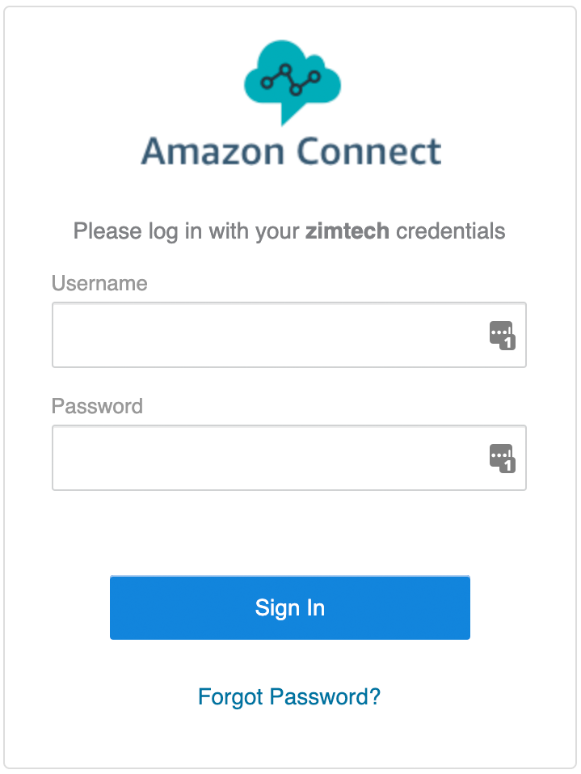

In this section we will walk through the process of setting up our new Amazon Connect Virtual Contact Centre Instance, locations for it to store logs and recordings and configure our encryption settings. 

What we will end up with by the end of this section is a fully self-contained and working Amazon Connect Contact Centre Instance ready for our Administrator to start configuration activities.

<i>P.S. It's important to note that if you still have your Amazon Connect Instance running from the previous part of the workshop series you can use that instead of following this section. In that case simply move onto the next section.</i>

# Next Steps
To get started, proceed to the <b>Configure a new Instance</b> section by click the <b>next</b> button below or selecting it from the sidebar on the left.