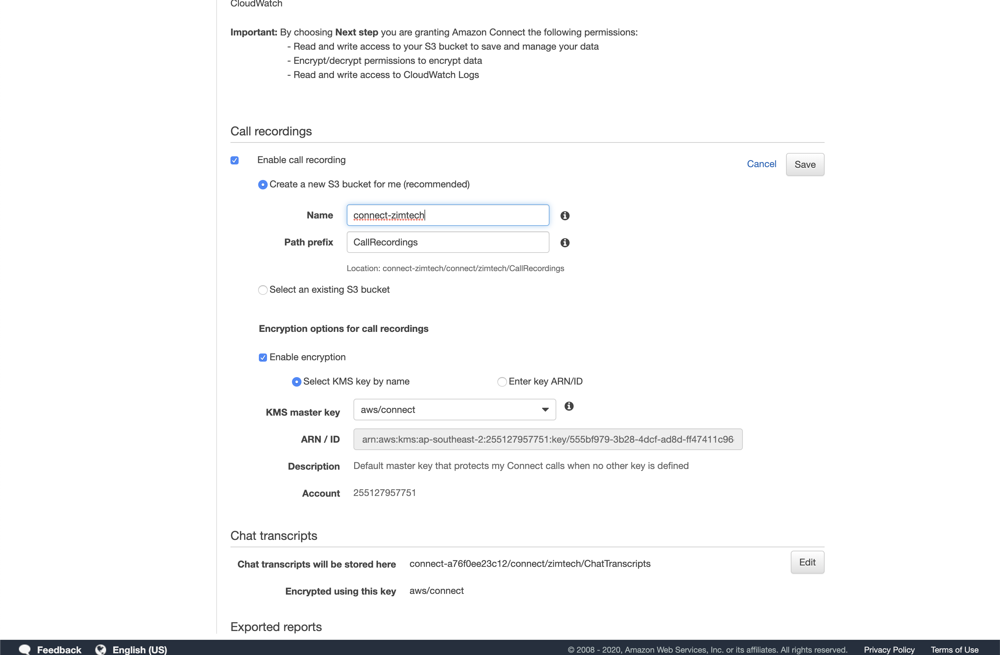

## Overview
If you've followed along with the requirements set out in the previous section you should have your AWS account ready and be logged in with an IAM user that has <b>AmazonConnectFullAccess</b> permissions (while it is possible to provision a new Virtual Contact Centre Instance with less permissions than this, <b>AmazonConnectFullAccess</b> ensures your account will be able to take all actions outlined in this workshop). 

By the end of this section we will have created an <b>Amazon Connect Virtual Contact Centre Instance</b>. This instance is responsible for hosting all of the direct in-dials, contact flows, prompts and other components of your contact centre. While it is possible to link an Instance into an existing Active Directory environment, for the sake of this workshop we will configure Amazon Connect to provision and manage it's own identities.

## Getting Started
1. To get started, we want to visit the Amazon Connect Management Console available at [https://ap-southeast-2.console.aws.amazon.com/connect/](https://ap-southeast-2.console.aws.amazon.com/connect/) (note the <b>ap-southeast-2</b> region being used). Assuming you are using an AWS account that has never been used to deploy Amazon Connect before, you will be presented with the "Quick Start" page shown below. Click "Get Started" to begin the provisioning process.

## Identity Provider
This first page asks which User Directory you'd like to use for the new Instance. Amazon Connect supports:
  - Storing users within Amazon Connect
  - Linking to an existing Directory within your AWS Account
  - SAML 2.0 based authentication.
You can find detailed information on the benefits and limitations of each option available [here](https://docs.aws.amazon.com/connect/latest/adminguide/connect-identity-management.html).
2. For the purposes of this workshop we will make sure to select the "Store Users within Amazon Connect" option.

Because we are having Amazon Connect manage our identity provider for us, we need to provide an AWS Apps tenant name for it to use. This name must be globally unique and conform to AWS service limitations.

3. Provide a globally unique Access URL name that Amazon Connect will use to host your new Amazon Connect Instance from and click <b>"Next Step"</b> to continue. For the purposes of the below screenshot, i've used <b>zimtech</b>.

## New Admin User
Moving onto our next section, because we are having Amazon Connect provision out Identity Provider for us, we need to provide some details so it can create us a new Admin User Account. It's important not to skip this step.

4. Enter some user details as shown below. Note that the <b>Username</b> field is case sensitive. Once you've populated all available fields, click "Next Step" to move onto configuring the "Telephony Settings". 

## Telephony Settings
Here we are simply given the option of wether we wish to allow inbound and outbound calls to be handled by our Contact Centre. 

5. For the purposes of our demo, we will make sure that both options are checked and the <b>"Next Steps</b>.

## Data Storage
This next section is all about where and how Amazon Connect stores the call recordings, logs and reports that are generated by the Amazon Connect Instance. While the default options will work fine, it is easier to manually configure the S3 Bucket name to make working with your artifacts a little easier.

6. From the <b>"Data Storage"</b> page, click the <b>"Customize settings"</b> hyperlink.

These custom settings allow us to define different locations for each of the:
- Call Recordings
- Chat Transcripts
- Exported Reports
- Contact Flow Logs
For the purpose of this workshop we will change the S3 Bucket Name used for each of these artefact types.

7. Click the <b>"Edit"</b> button next to the <b>Call recordings</b> section.

8. Change the S3 bucket name to something more recognizable (keeping in mind S3 Bucket Naming limitations) and click "Save".

9. Perform the same process for the <b>Chat Transcripts</b>

10. And the <b>Exported Reports</b>.

11. Once you've save the settings for the <b>Exported reports</b>, make sure that the <b>Enable Contact flow logs</b> checkbox is checked and click <b>"Next Steps"</b>.

## Review
12. The final step before Amazon Connect creates our new instance is for us to review our selected settings. Once you've had a chance to review them, click the <b>"Create Instance"</b> button.

AWS Will start the provisioning process of your new Amazon Connect Contact Centre Instance. This typically only take a minute.

Once it's finished provisioning, you should be presented with the screen below.

Notice how we've been provided with a new URL we can use to access our Connect Instance from (At the bottom of the above screenshot). We will use this URL (https://zimtech.awsapps.com/connect in the above example) in the next section to validate the successful deployment of our Contact Centre.

## Next Steps
You should now have your AWS account ready to deploy your Amazon Connect instance in as well as be using an IAM user with <b>"AmazonConnectFullAccess"</b> permissions. Once you have both of these in place, you can proceed to the "Introduction" stage of the workshop be clicking the link below or on the sidebar to the left.