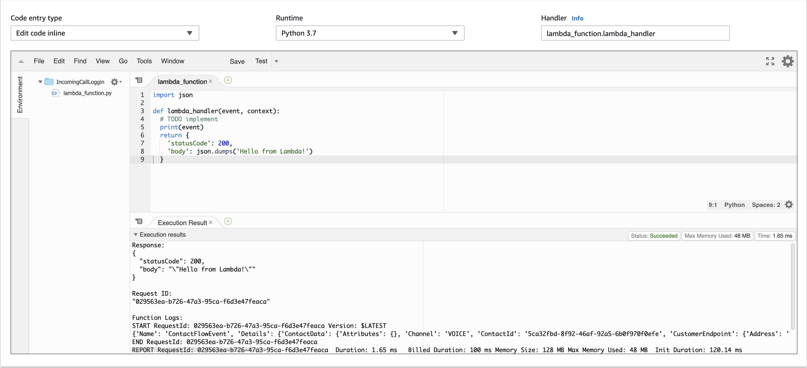

## Overview
In this section we will walk through the process of capturing the incoming phone number of a caller and passing it through to a lambda function.

We will start off my creating a new Python Lambda Function and adding some basic code. We will then go on to make cure that our Amazon Connect Instance has the correct permission to trigger our function. Finally, we will modify our Contact Flow to capture the incoming callers phone number and send that through to our Lambda function for use in the next section.

## Next Steps
To get started, proceed to the <b>Create a Lambda Function</b> section by click the <b>next</b> button below or selecting it from the sidebar on the left.
