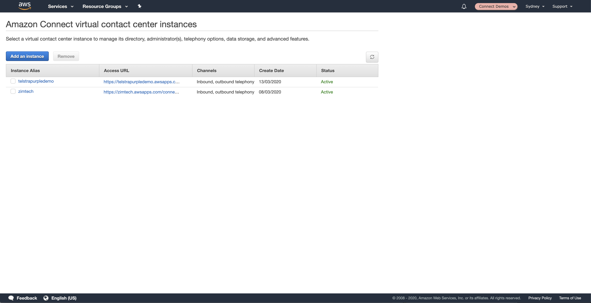
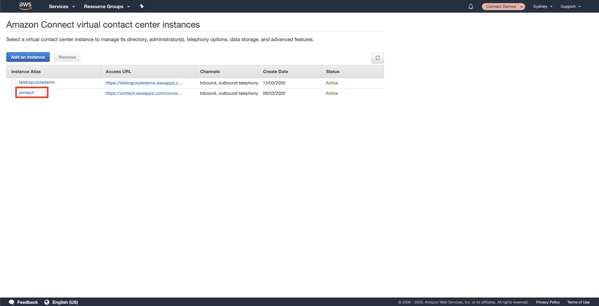
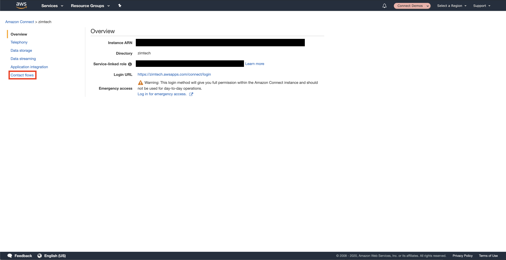
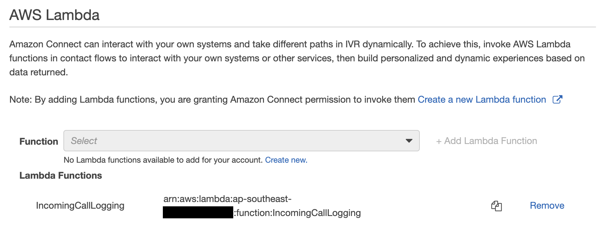

## Overview
In this chapter we will configure Amazon Connect so that i can access the AWS Lambda Function we created in the last chapter. Until we do this we will be unable to add it to our contact flows.

## Getting Started

1. Firstly, we need to browse to the Amazon Connect Management Console by visiting [https://ap-southeast-2.console.aws.amazon.com/connect/](https://ap-southeast-2.console.aws.amazon.com/connect/).

2. Click on the <b>Instance Name</b> of the Amazon Connect instance you created in section 1. <b>DO NOT CLICK ON THE ACCESS URL</b> as this will take you to your instance login page rather than the instance configuration page.

3. From the left hand menu, select <b>Contact Flow</b>.

4. From the <b>AWS Lambda</b> section, select our new Lambda Function from the dropdown menu and click <b>Add Lambda Function</b>.

## Next Steps
And that's all she wrote. The Amazon Connect Instance now has access to our Lambda function and we can go ahead and add it to our <b>Contact Flow</b> in the next chapter. You can proceed to the next chapter of the workshop be clicking the link below or on the sidebar to the left.