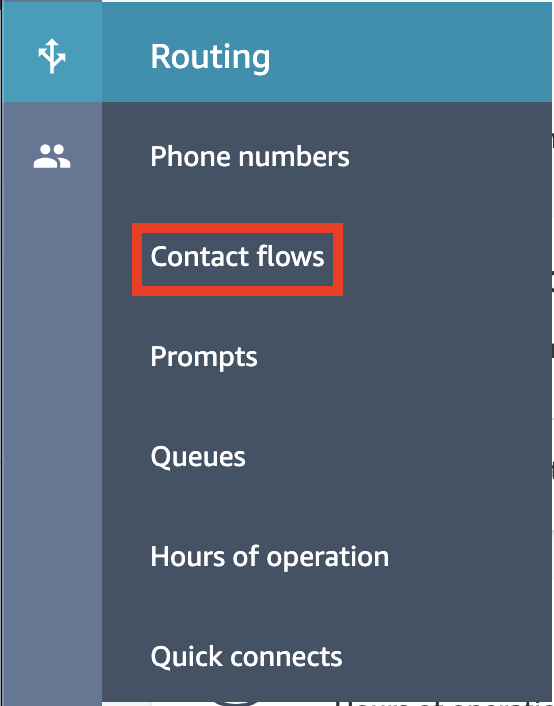

## Overview
In this chapter we will finally go ahead and add our new Lambda function to a new Amazon Connect Contact Flow.

## Getting Started

1. Firstly we now need to log into our Amazon Connect Instance by visiting the Access URL. This can be found by browsing to the Amazon Connect Virtual Contact Center Instances page.

2. Once we've logged into our instance we need to browse to the <b>Contact Flow</b> page which can be found under the <b>Routing</b> section. 

3. Next, go ahead and crate a new contact flow by clicking the <b>Crate Contact Flow</b> button at the top of the page. NOTE: There are multiple options available in the dropdown so be sure to select the right one.

4. On the <b>Contact Flow</b> design page, firstly give it a name. For the purposes of the workshop we will use the name <b>IncomingLambdaIntegraton</b> and then click <b>Publish</b>.

5. Next we need to drag a <b>Invoke AWS Lambda Function</b> object from under the <b>Integrate</b> menu and place it on the design page as shown below. Go ahead and link the <b>Entry Point</b> Object to the input of the method.

6. Then, click on the <b>Invoke AWS Lambda Function</b> heading to open the configuration window. In the config window, we can select the <b>IncomingCallLogging</b> function from the <b>Select a Function</b> dropdown. For the moment we are not passing any parameters into the function so we can go ahead and click <b>Save</b>.

7. Next is some house keeping. We need to add a <b>Play Prompt</b> to our contact flow so we know when it's answered the call and we need to add a <b>Disconnect / Hang-Up</b> to close the flow out. Simply join each of the methods together as shown below.

8. We also need to configure a Prompt for the <b>Play Prompt</b> Step to play. Select the step and select the <b>beep.wav</b> from the dropdown and click save. This is only serving as a place holder so we know when Amazon Conenct has answered the call.

9. And last but not least, click the <b>Publish</b> button again to save the changes to the Contact flow and make it available to add to an inbound number.

## Next Steps
We now have our Lambda function and it's configured as a part of our contact flow. In the last chapter of this section we will add the contact flow to an inbound phone number so we can call it. You can proceed to the next chapter of the workshop be clicking the link below or on the sidebar to the left.
