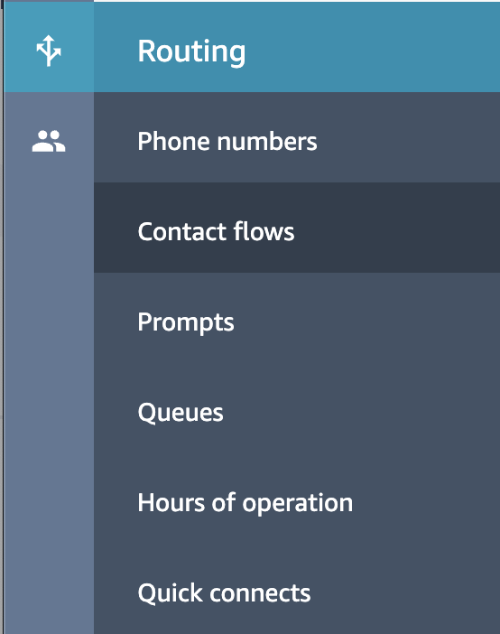
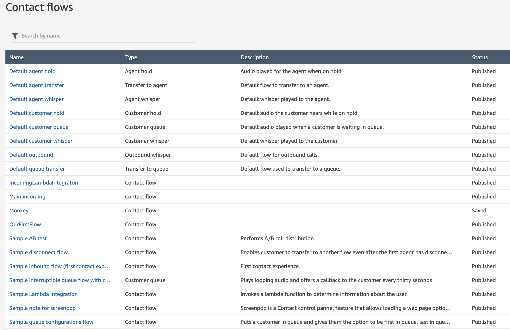
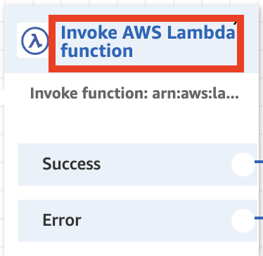
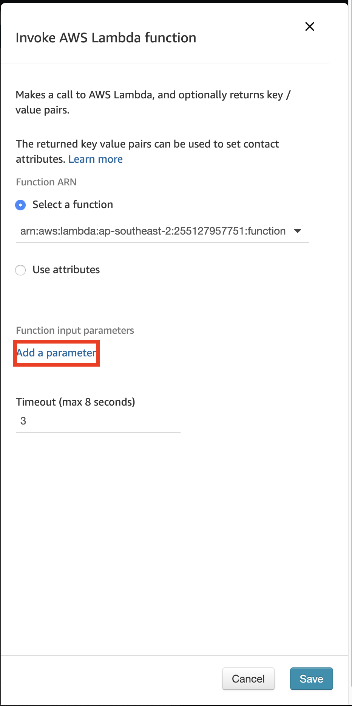
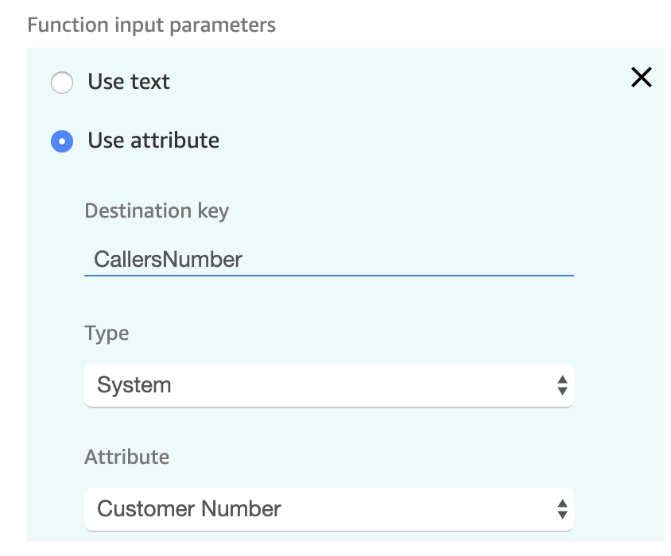
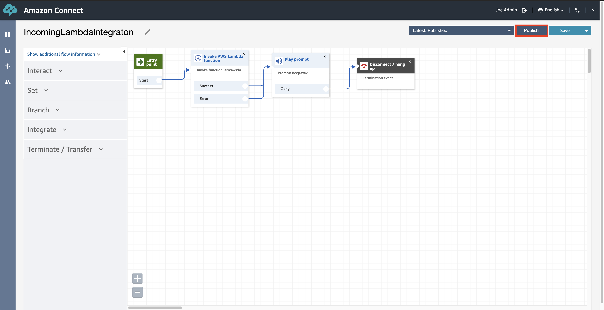

## Overview
In this chapter we will modify the <b>Contact Flow</b> we created in the previous section to capture the callers phone number and pass it to our <b>AWS Lambda Function</b>.

## Getting Started
1. To get started, we need to browse back to our <b>Contact Flow</b> page in our <b>Amazon Connect Instance</b>.

2. Next, open up our <b>IncomingLambdaIntegration</b> Contact Flow from the list.

3. What we want to do is to open up the configuration of the lambda function, so go ahead and click on the heading of the <b>Invoke AWS Lambda Function</b>.

4. Here we want to click on <b>Add a Parameter</b>.

5. We have a couple of options for passing parameters. Given we want to pass an already known value (the callers phone number), we can actually select <b>use Attribute</b>. Then we can give it a name <b>CallersNumber</b> and then specify that we want a <b>System</b> attribute and then that we want the <b>Customer Number</b> Attribute Value. Once you've selected all of this, go ahead and <b>save</b> the configuration.

When browsing through the dropdown's you will notice that we actually have access to a lot of information about the status and state of the call.

6. Because we have updated our <b>Contact Flow</b> we will now need to publish the changes by clicking the <b>Publish</b> button at the top of the page.

## Next Steps
Our Amazon Connect Contact Flow will now pass the callers phone number to our Lambda Instance. In the next section we can capture that information and store it in a DynamoDB table for future use. You can proceed to the next chapter of the workshop be clicking the link below or on the sidebar to the left.