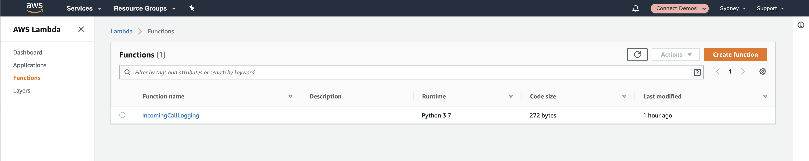

## Overview
In this chapter we will modify the <b>Lambda Function</b> we created in the previous section to consume the payload being submitted by <b>Amazon Connect</b>.

## Getting Started
1. To get started, we want to visit the AWS Lambda Management Console available at [https://ap-southeast-2.console.aws.amazon.com/lambda/](https://ap-southeast-2.console.aws.amazon.com/lambda/) (note the <b>ap-southeast-2</b> region being used). This should display a list of your lambda functions within the current region as shown below (you page may contain lambda functions). Go ahead and select the one we created previously.


2. Next we need to update our existing <b>Lambda Function</b> so that it can pick up the new Parameter we are sending. Replace the existing <b>AWS Lambda</b> code with the below:

```python
import json

def lambda_handler(event, context):
  CallersNumber = event['Details']['Parameters']['CallersNumber']
  print(CallersNumber)
  return {
    'statusCode': 200,
    'body': json.dumps('Hello from Lambda!')
  }
```
Here you will notice that we are simply retrieving the <b>CallersNumber</b> Parameter (which is what we defined in the last chapter) and assigning it to a variable. We are then printing that variable out to our log for reference.

3. Go ahead and save the <b>AWS Lambda Function</b> and you are ready to call your Contact centre. Because this stage hasn't directly changed the Amazon Connect configuration we don't need to re-publish the <b>Contact Flow</b> so you can ring the number straight away.

4. Once you've called the number, you should look at your <b>CloudWatch Logs</b> to make sure that your number has been captured correctly. To do this, browse to [https://ap-southeast-2.console.aws.amazon.com/cloudwatch/home?region=ap-southeast-2#logs:](https://ap-southeast-2.console.aws.amazon.com/cloudwatch/home?region=ap-southeast-2#logs:).


5. From the list, Select the <b>/aws/lambda/IncomingCallLogging</b> Log Group.

6. After a moment (remember that CloudWatch Logs appear in Near real time) refresh the page and you should see an entry for the lambda function being executed. Select the most recent execution


7. And if all is working correctly, you should see your phone number appear as an entry in your logs (note i've blacked out the number for privacy purposes).


## Next Steps
We now have the callers phone number being captured by our <b>AWS Lambda Function</b> and being written to our logs. In the next section we will start writing this information to a DynamoDB table so that we can track when individuals call our Contact Centre. You can proceed to the next chapter of the workshop be clicking the link below or on the sidebar to the left.