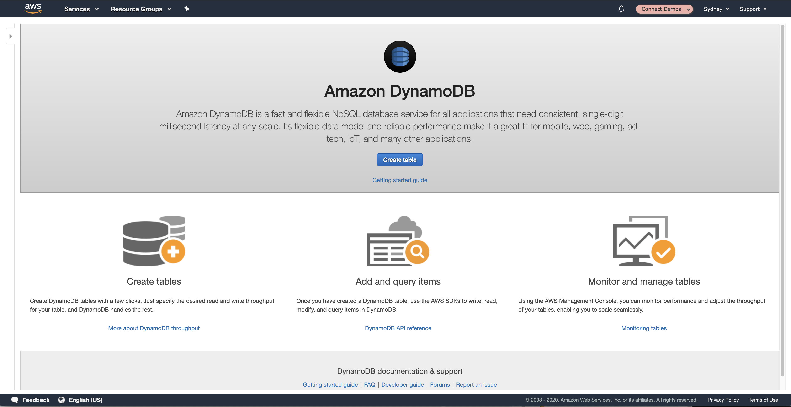
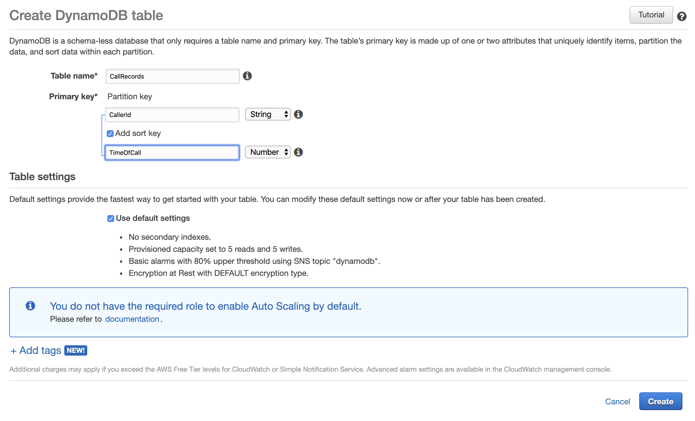
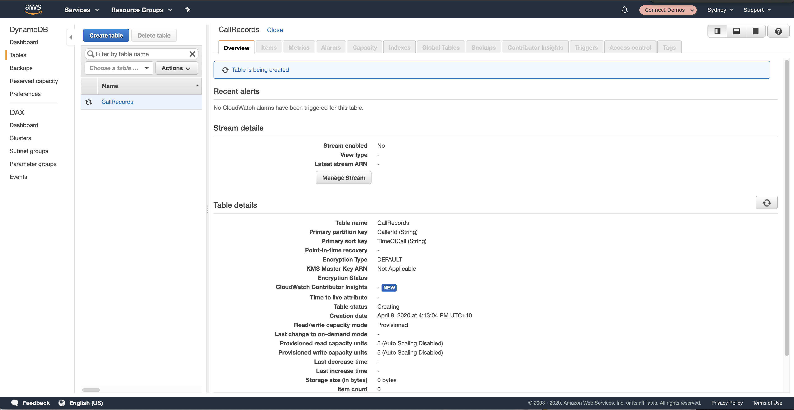

## Overview
In this chapter we will create a <b>DynamoDB Table</b> for us to start putting all of our call records into. This will allow us to quickly and easily see who's calling and when.

## Getting Started
1. To get started, we want to visit the AWS DynamoDB Management Console available at [https://ap-southeast-2.console.aws.amazon.com/dynamodb/home](https://ap-southeast-2.console.aws.amazon.com/dynamodb/home). Assuming you've never used <b>DynamoDB</b> before in your account you should see a screen similar to the one below. to move onto the next step, simply click <b>Create Table</b>.

2. We now need to define the settings for our new DynamoDB table. For the Table name we can define <b>CallRecords</b>, for our Partition Key we will <b>CallerId</b> and for the Sort Key (check the Sort Key Checkbox) we can define <b>TimeOfCall</b>. In a production system we might want to give some more thought to our partition structure but this will work fine for our workshop's requirements. Also note that we have kept the Partition key as a <b>String</b> while the CallerId is a <b>Number</b>. Once you've populated those settings, go ahead and click <b>Create</b> at the bottom of the page.

3. You will be presented with a screen showing that the table is being created. Just wait a couple of minutes and refresh the page.

## Next Steps
And that's all there is to creating a DynamoDB table. In the next Chapter we can go back to our <b>AWS Lambda Function</b> and update the code and it's permissions so we can start writing the information to the table. You can proceed to the next chapter of the workshop be clicking the link below or on the sidebar to the left.