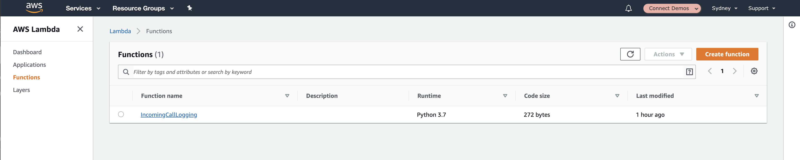
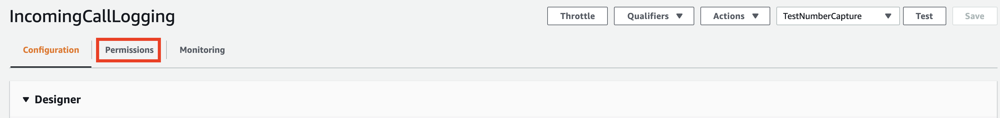
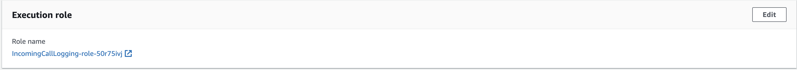
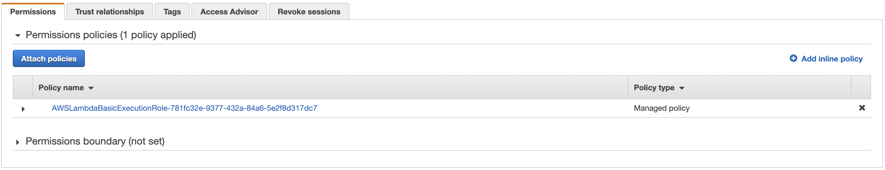
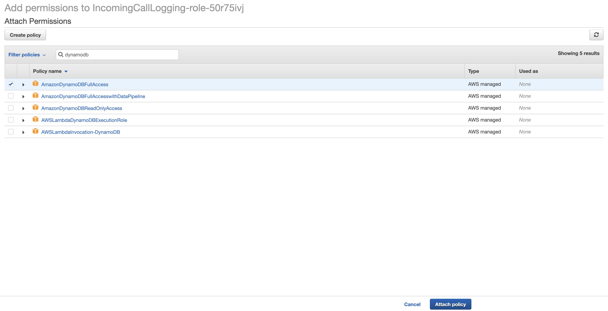
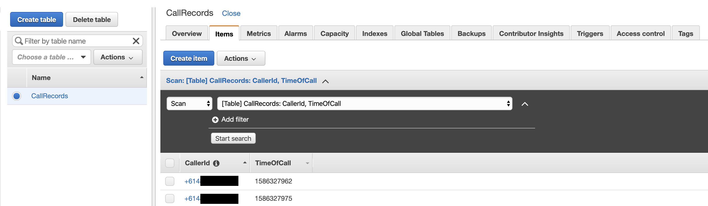

## Overview
In this chapter we will update our <b>AWS Lambda Function</b> to have the code and the permissions to write our Caller's Phone Number into our new DynamoDB table along with the time that they called.

## Getting Started
1. To get started, we want to visit the AWS Lambda Management Console available at [https://ap-southeast-2.console.aws.amazon.com/lambda/](https://ap-southeast-2.console.aws.amazon.com/lambda/) (note the <b>ap-southeast-2</b> region being used). This should display a list of your lambda functions within the current region as shown below (you page may contain lambda functions). Go ahead and select the one we created previously.


2. Next we need to update our existing <b>Lambda Function</b> again so that it can write to the <b>DynamoDB</b> table we created in the last chapter. Replace the existing <b>AWS Lambda</b> code with the below:

```python
import json
import calendar
import time
import boto3

# Get the Service Resource
dynamodb = boto3.resource('dynamodb')

def lambda_handler(event, context):
  # Instantiate a table resource object without creating the table
  table = dynamodb.Table('CallRecords')

  # Get current time from epoh
  ts = calendar.timegm(time.gmtime())

  # Get Parameter from event
  CallersNumber = event['Details']['Parameters']['CallersNumber']
  
  # submit record to DynamoDB
  table.put_item(
      Item={
          'CallerId': CallersNumber,
          'TimeOfCall': ts
      }
  )

  return {
    'statusCode': 200,
    'body': json.dumps('Hello from Lambda!')
  }
```

The code above adds both the logic to write to the DynamoDB table as well as the calendar and Time libraries so we can get the current time and write that long with the callerId to the Table. Once you've updated the code, go ahead and save it by clicking the button at the top of the screen.

3. Next thing we need to do is update the security permissions of the Lambda Function. To do this, Click on the <b>Permissions</b> Tab at the top of the page.


4. From here, click on the <b>Role Name</b> list under the <b>Execution Role</b>. This will open up the IAM Role in a new tab.


5. Now we are going to add the required permission for the <b>AWS Lambda Function</b> to write to the DynamoDB table. 
<b>NOTE: THIS IS ONLY FOR TESTING AND SHOULD NOT BE USED IN A PRODUCTION ENVIRONMENT</b>. 

6. Click the <b>Attach Policies</b> button.


7. In the search box, type <b>dynamodb</b> and select <b>AmazonDynamoDBFullAccess</b> from the list and then click save.


8. Once that's applied we are ready to test our lambda function. Ring your inbound phone number again and wait for it to play the <b>Beep</b> and hang-up the call.

9. Next, open your DyanmoDB table's Item's view by visiting [https://ap-southeast-2.console.aws.amazon.com/dynamodb/home?region=ap-southeast-2#tables:selected=CallRecords;tab=items](https://ap-southeast-2.console.aws.amazon.com/dynamodb/home?region=ap-southeast-2#tables:selected=CallRecords;tab=items). This link should work if you've used the same naming convention outlined in the workshop, otherwise browse to the DynamoDB management console and open the <b>CallRecords</b> table. If everything has worked correctly, you should now see call records appearing in your database table.


## Next Steps
We now have the CallerId Records being written to the DynamoDB table. In the next chapter we will perform a check to see if the caller has rang previously and return that to the contact centre in the response payload. You can proceed to the next chapter of the workshop be clicking the link below or on the sidebar to the left.