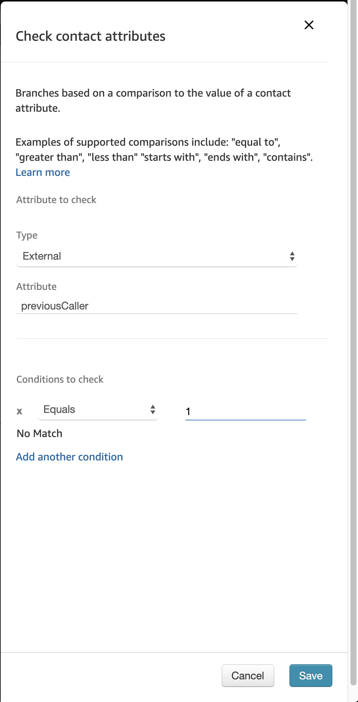

## Getting Started
1. To get started, we need to browse back to our <b>Contact Flow</b> page in our <b>Amazon Connect Instance</b>.

2. Next, open up our <b>IncomingLambdaIntegration</b> Contact Flow from the list.

3. Next, we need to move some things around the page so we can make from for our new conditional checks. Delete the connections between the <b>Invoke AWS Lambda Function</b> and the <b>Play Prompt</b>.

4. Now, we need to copy in another couple of components. Firstly, we want a <b>Check Contact Attributes</b> from the <b>Branch</b> Menu. This will go after our lambda function to check the results. Then we want two <b>Play Prompts</b> One for if the user is a new caller and one if they are a return caller. Finally, we want to link the <b>Beep</b> prompt we've been using to the <b>Error</b> status of our <b>Lambda</b> function and the <b>Success</b> to the <b>Check Contact Attribute</b> function.

5. Next, Click on the <b>Check Contact Attribubte</b> heading to open the configuration page.

6. Here we are going to define the attribute to check. As it's a value from an external source, go ahead and select <b>External</b> from the <b>Type</b> dropdown and define our <b>previousCaller</b> variable to the <b>Attribute</b> value.

7. Under <b>Condition to Check</b> we will check if the value is Equal to 1 which shows that the caller exists in our <b>CallRecords</b> DynamoDB table. Once we've entered that, we can go ahead and click save.

8. Now that we've defined our conditional checks we can link our Prompts up to the <b>Check Contact Attribute</b> component. Link one <b>Play Prompt</b> to each of the possible outcomes as shown below.

9. For our <b>Play Prompt</b> Connected to the <b>=1</b> output we want to acknowledge that they have called before. Set the prompt to <b>Text-To-Speech</b> and provide some custom text.

10. For our <b>Play Prompt</b> Connected to the <b>No Match</b> output we want to given the caller a common response. Again, Set the prompt to <b>Text-To-Speech</b> and provide some custom text such as that shown below.

11. Finally, link the outputs from both of the <b>Play Prompts</b> to the <b>Disconnect Hang-up</b> component so the call has somewhere to go, and click <b>Publish</b>.

# Next Steps
And that's it... Your contact flow will now check the incoming caller's number and provide different responses depending on the returned check. To validate that your solution is working, you will need to delete your records from the DyamoDB table.