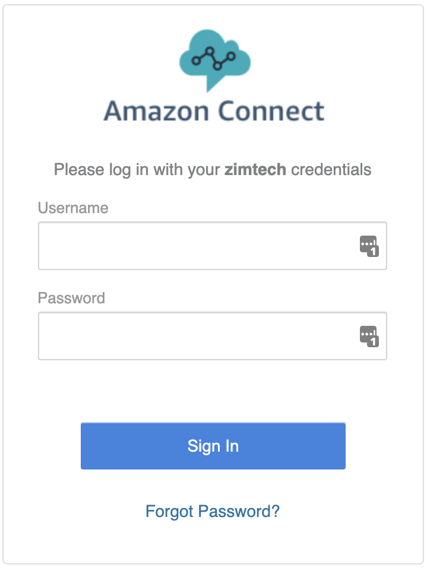
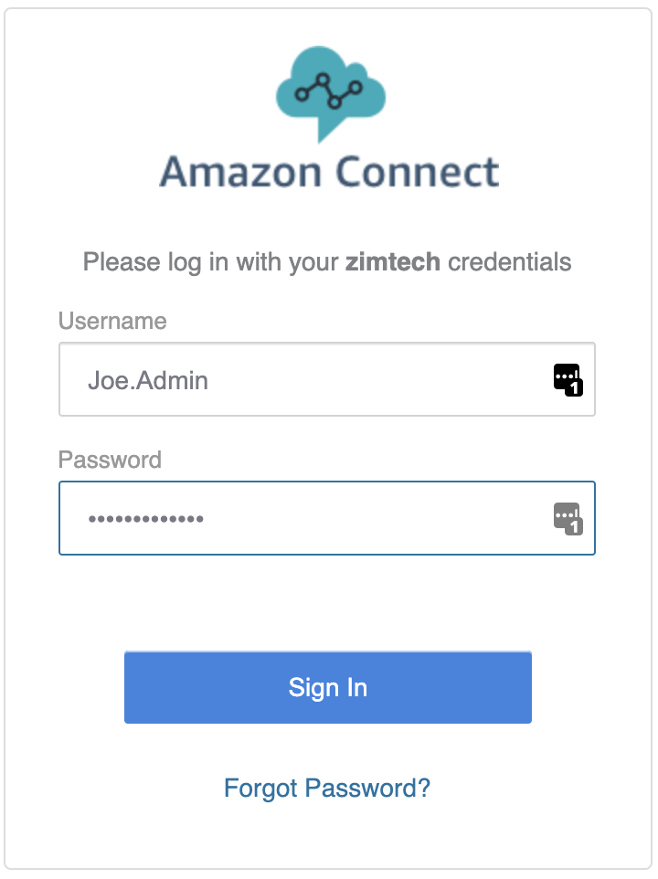
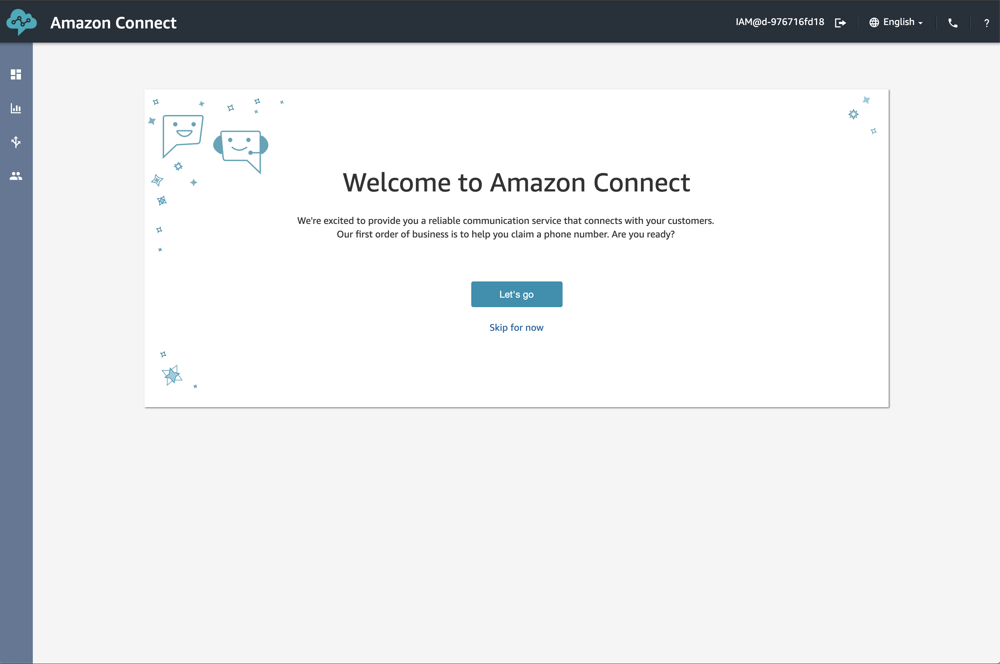
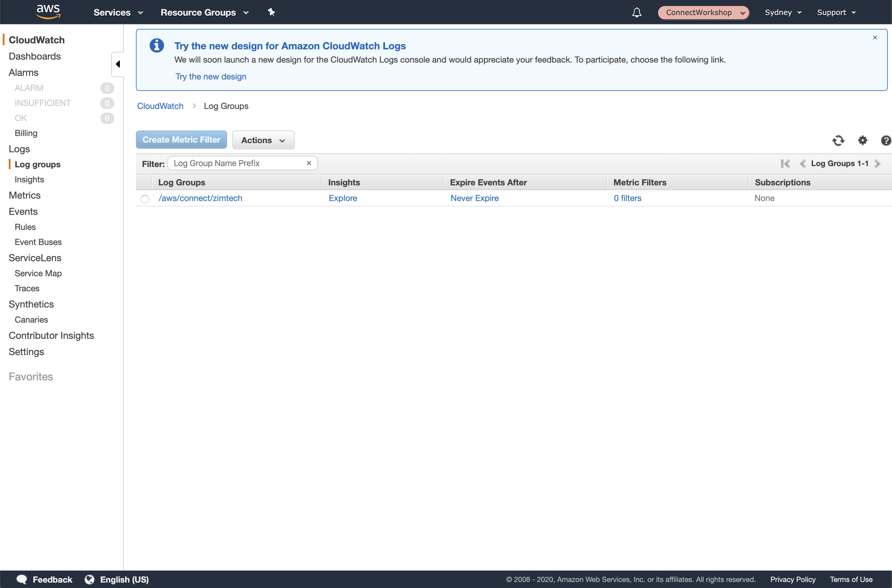
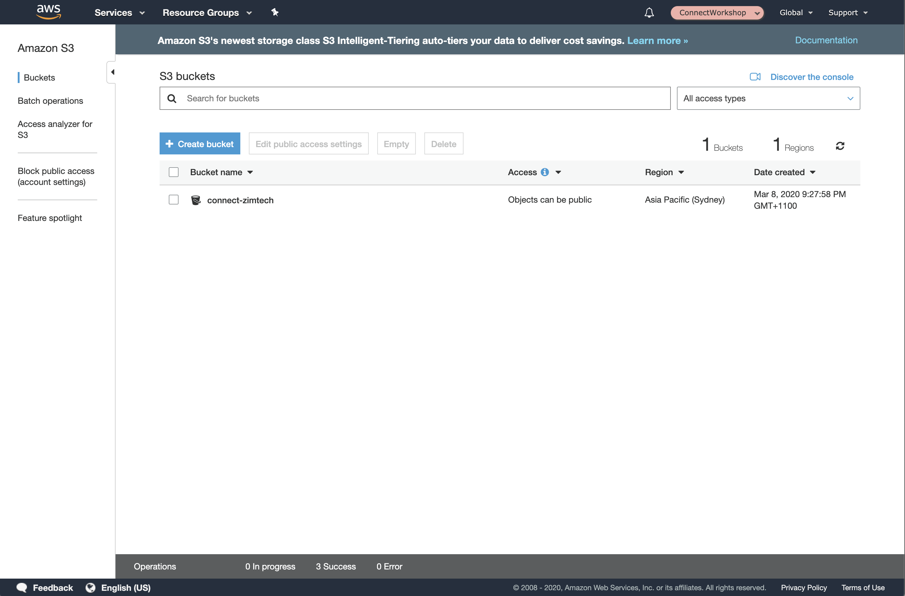

## Overview
Before we get started configuring the new Amazon Connect Instance we deployed in the previous section we must first validate that all of the components have been deployed successfully and in the way we expect. This sections walks you through each of the main components that Amazon Connect will use.

## Virtual Contact Centre Instance
First things first is to make sure that we can login to our new Virtual Contact Centre Instance. To do this we first browse to the URL that was provided to us at the end of the last section (Step 12). For our example the website address is https://zimtech.awsapps.com/connect and once browsed to displays a login form like the one shown below.

1. To continue, enter the username and password you provisioned in <b>Step 4</b> of the previous section and click <b>Sign In</b> to continue.

Once you've successfully logged in you should be able to see the "Welcome to Amazon Connect" page. For the moment we can leave our instance the way it is, and will come back to it in the next phase of the workshop.

## Logging
2. Now the we know our Instance is configured and working as expected we can move onto our logging location. Given we made sure to tick the <b>Enable Contact flow logs</b> option in <b>step 7</b> of the last section if we browse to our [Cloud Watch Log Groups](https://ap-southeast-2.console.aws.amazon.com/cloudwatch/home?region=ap-southeast-2#logs:) we should be able to see a new Log Group by the name of <b>/aws/connect/%AppDirectoryName%</b> where AppDirectoryName is your tenant name, in the example below <b>zimtech</b>.

## Artefact Storage
3. Finally, we want to make sure that our S3 Buckets have been created. In a similar way to checking out Log Groups... if we open the our [S3 Management Console](https://s3.console.aws.amazon.com/s3/home?region=ap-southeast-2) you should see a new bucket with the same name we provided in the previous section. Again, much like the Log Groups the bucket should not contain anything at present but will be of importance as we progress throughout the remainder of this workshop.

## Nex Steps
You should now have a Virtual Contact Centre Instance you can log into and have the required S3 buckets created and ready for population. Once you have confirmed both of these are in place, you can proceed to the next stage of the workshop "First Inbound Contact Flow" by clicking the link below or on the sidebar to the left.

## Troubleshooting
Still to be written. For the moment, raise you hand and one of the Workshop coordinators will come over to assist you.