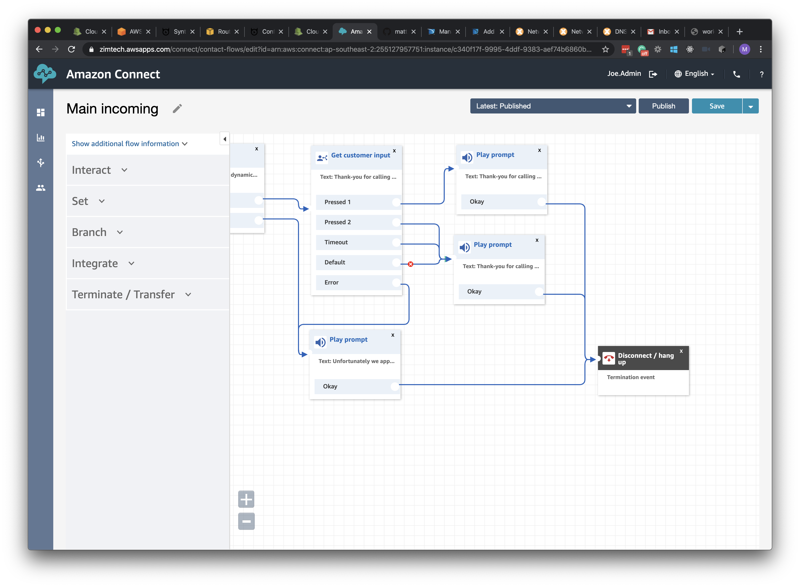
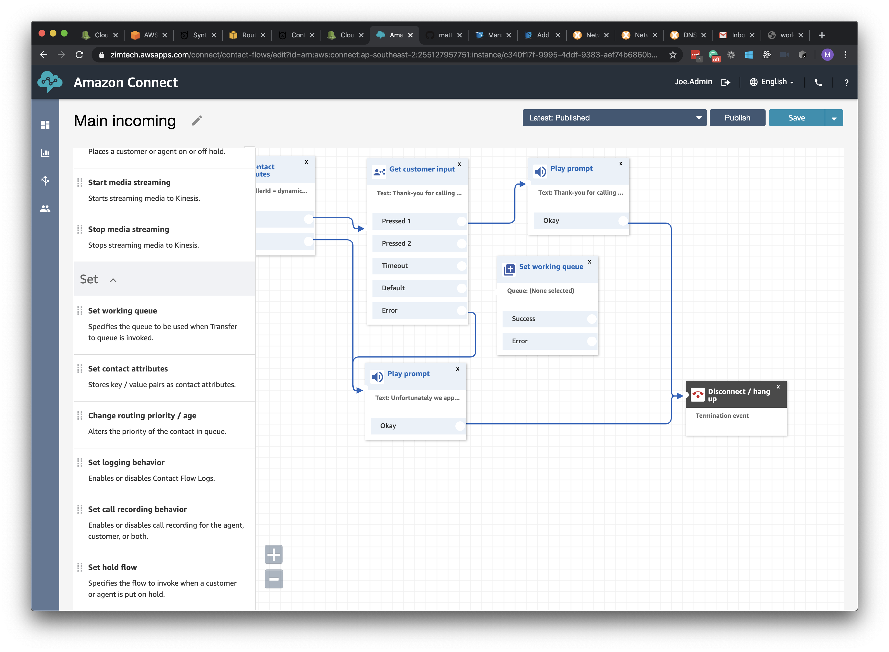
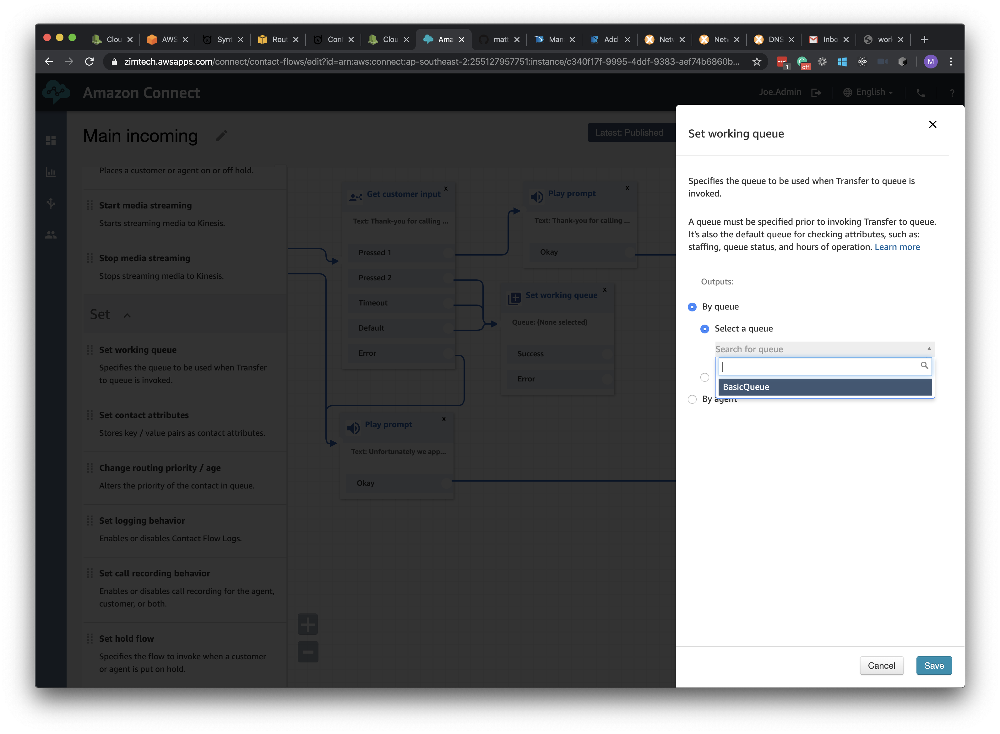
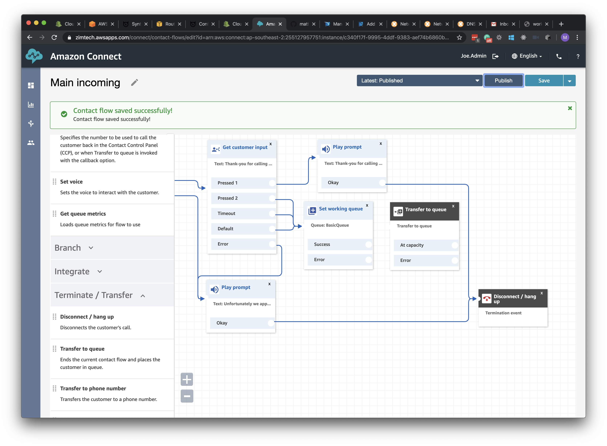
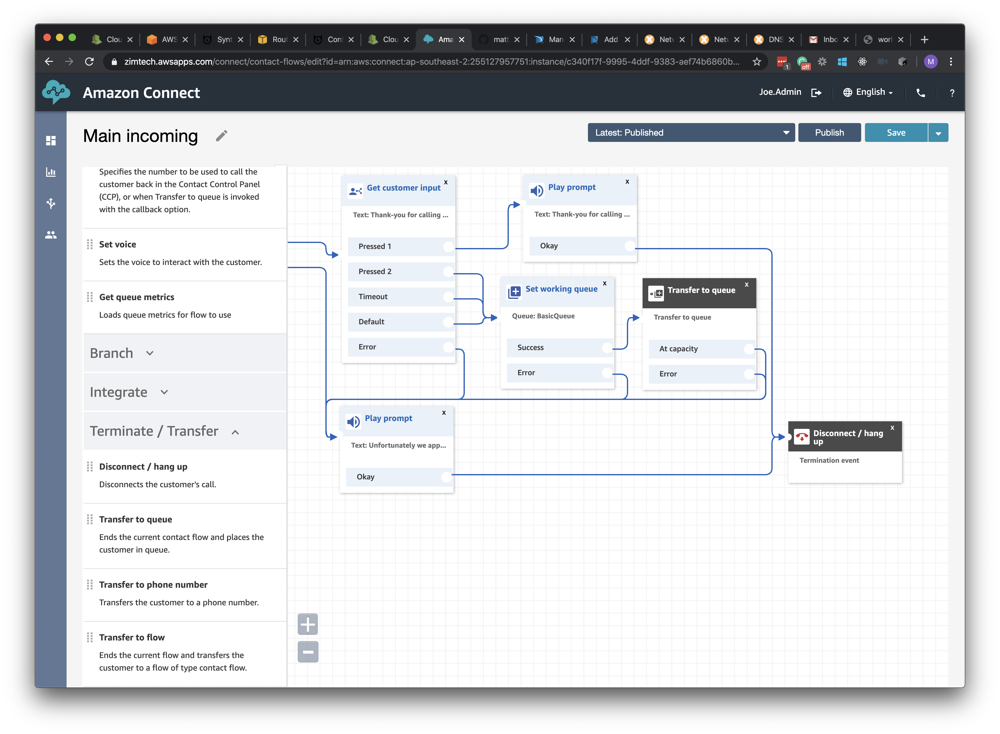
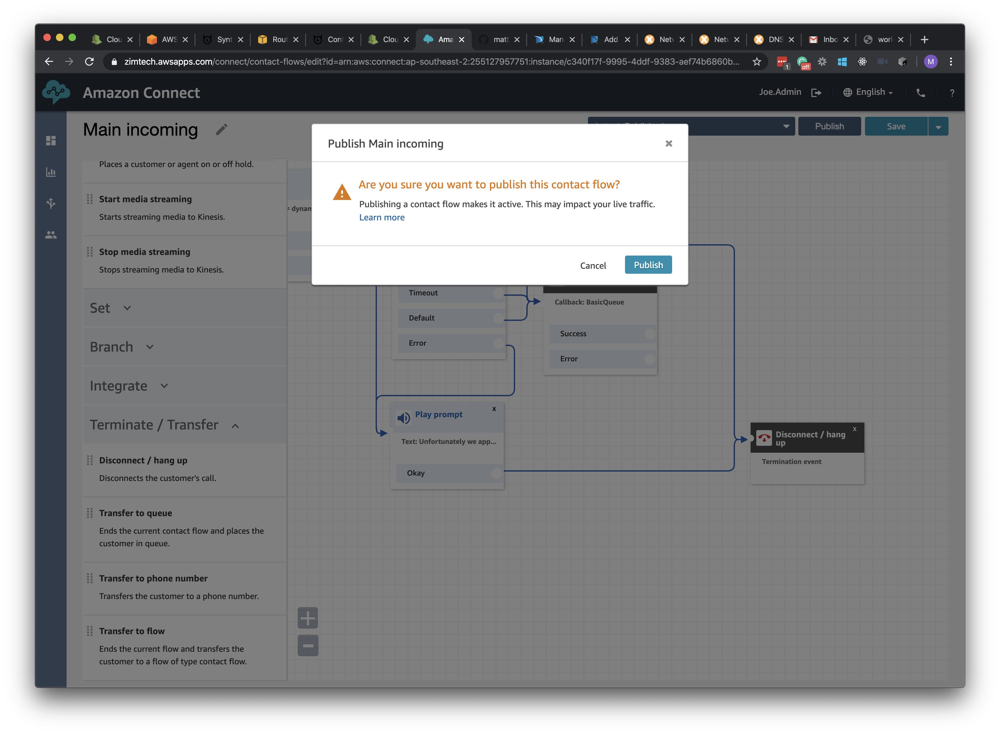

## Overview
First things first. We need to change our existing Contact Flow and add a couple of extra Content Blocks to handle the Queue Transfer.

## Adding Queue Transfer

1. If we open the <b>Main Incoming</b> Contact Flow we created in the <b>Adding Interactivity</b> section we should be presented with the flow as we left it with an IVR and two different <b>Play Prompt</b> Blocks at the end.

2. Our first step is to remove the <b>Play Prompt</b> Block attached to the Pressed 2, Timeout and Default outputs of the <b>Get customer input</b> Content Block and replace it with a <b>Set Working Queue</b> Block instead. Whenever we want to transfer a caller to a new Queue we need to define a valid working queue first and that's what this Content Block does.

3. In the Properties window of the <b>Set working queue</b> Block, we can select our <b>Basic Queue</b> which is the default queue pre-configured within the connect instance. Click <b>Save</b> once your done.

4. The next step is to add the <b>Transfer to Queue</b> block from the <b>Terminate/Transfer</b> Group of blocks. This is the block that will actually tranfer the call from this Contact Flow into the specific Queue ready to be handled by an Agent.

5. And finally, we need to link everything together. As you can see from the below, we pass the IVR outputs to the input of the <b>Set working queue</b> block. We then link it's <b>Success</b> output to the <b>Transfer to queue</b> and the <b>Error</b> output to our pre-existing error message block. Lastly, we route both failure scenarios of the queue transfer to the error block as well.

6. Click the <b>Publish</b> button. This will deploy the changes to the current running instance of our Contact Flow, meaning it will impact anybody calling into our Contact Centre. Had we only wanted to save our changes but not deploy them we could have only pressed the <b>Save</b> button.

## Nex Steps
Next we will need to Configure a new Agent user within our Connect Instance and set them up, ready to take some calls. proceed to the <b>Add Agents</b> section by click the <b>next</b> button below or selecting it from the sidebar on the left.