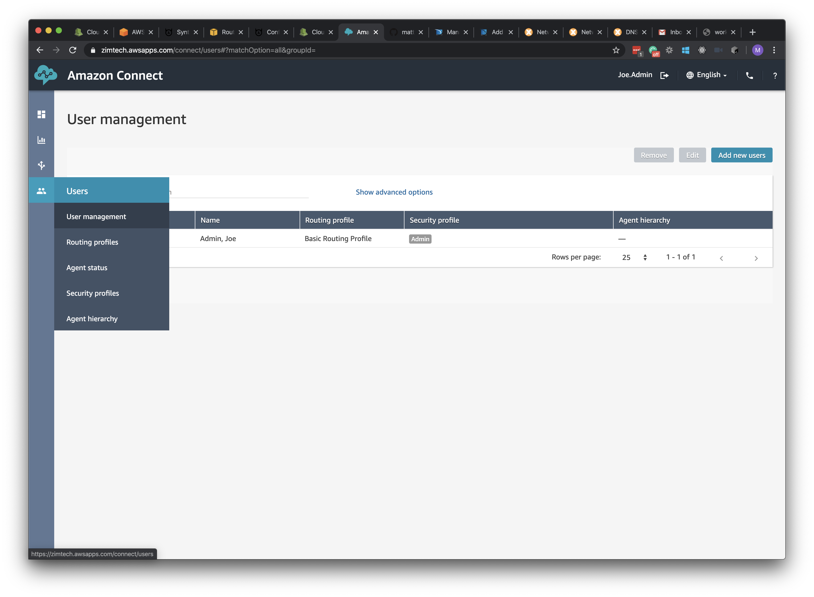
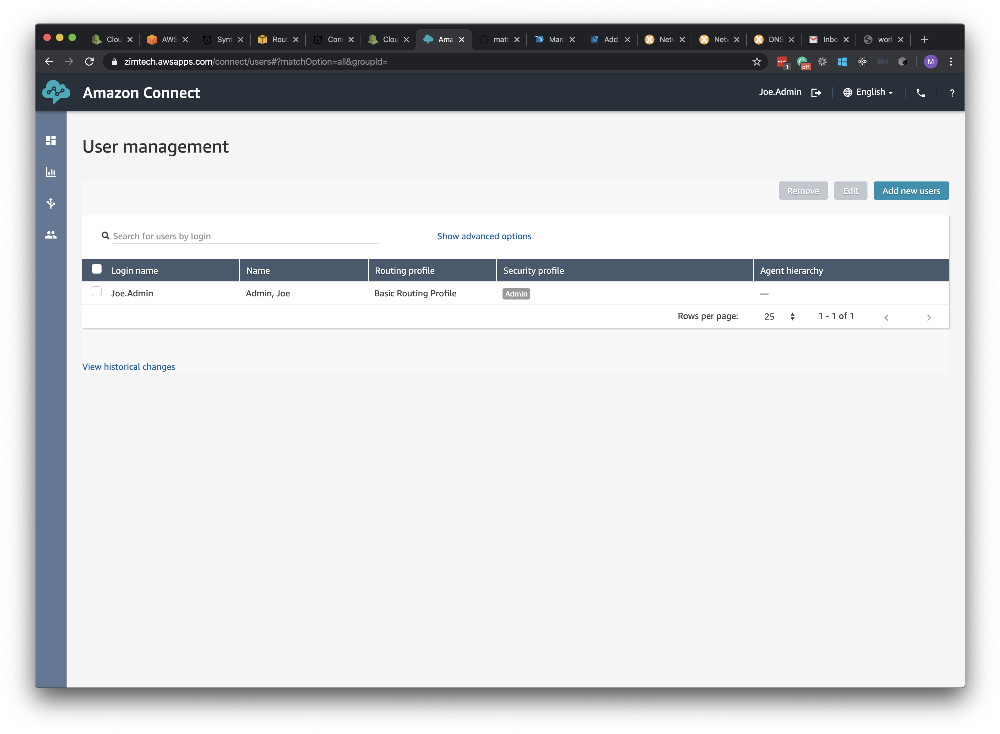
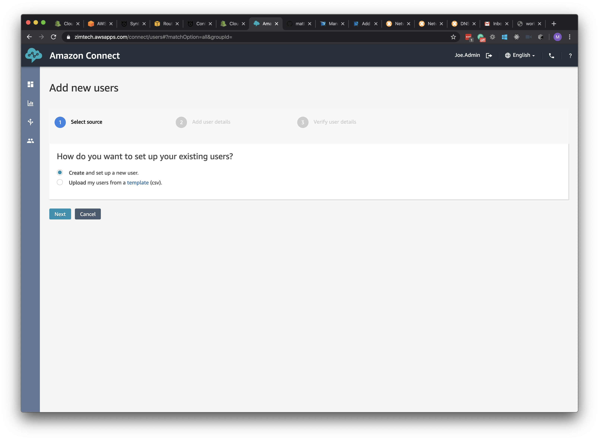
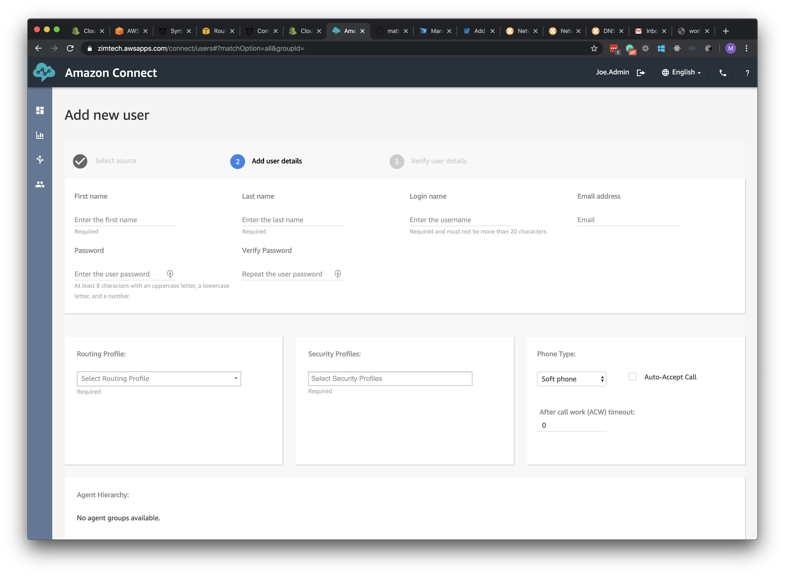
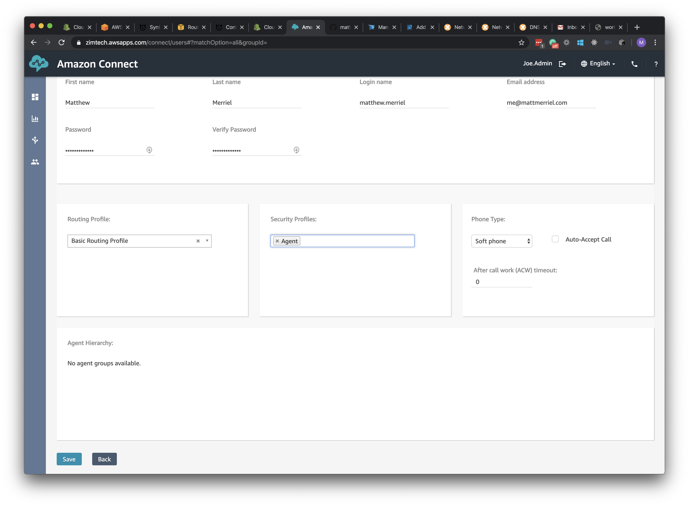
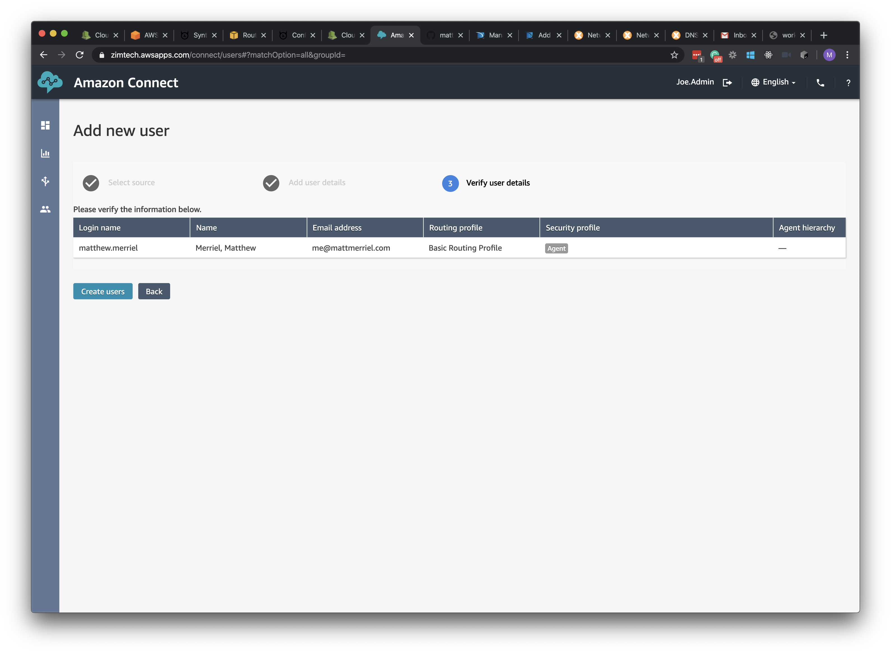

## Overview
Technically right now, if you where to ring your Toll-Free number and select Option 2, you'd land in a queue waiting for an agent... However, we don't currently have any agents. So lets set one up.

## Create new User Account

