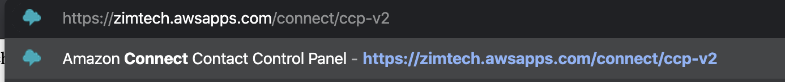
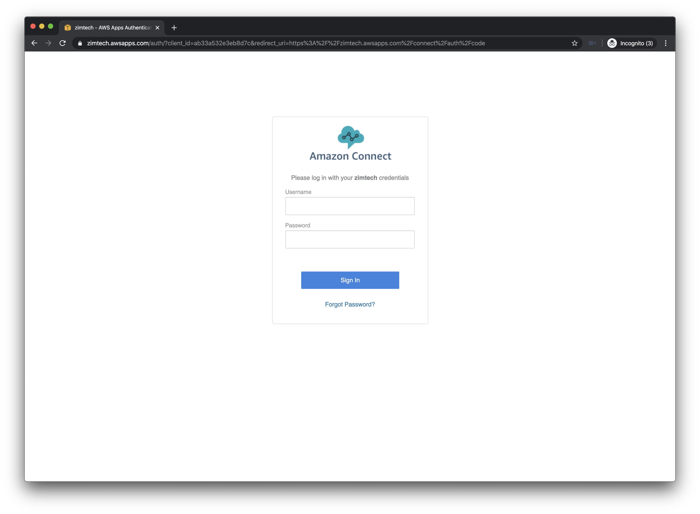
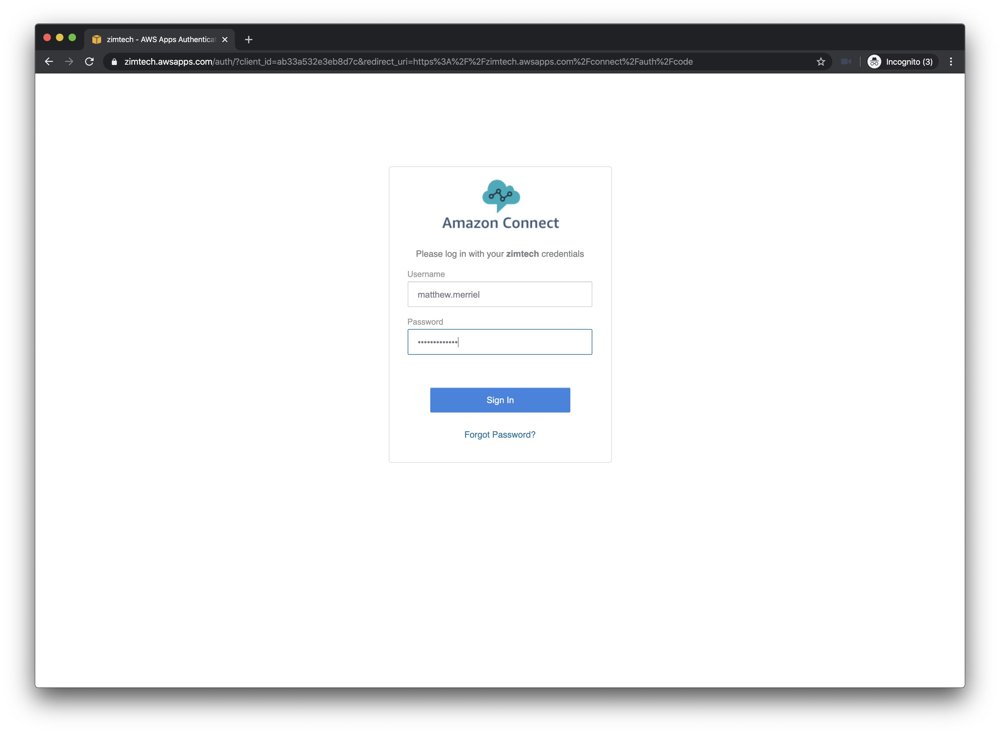
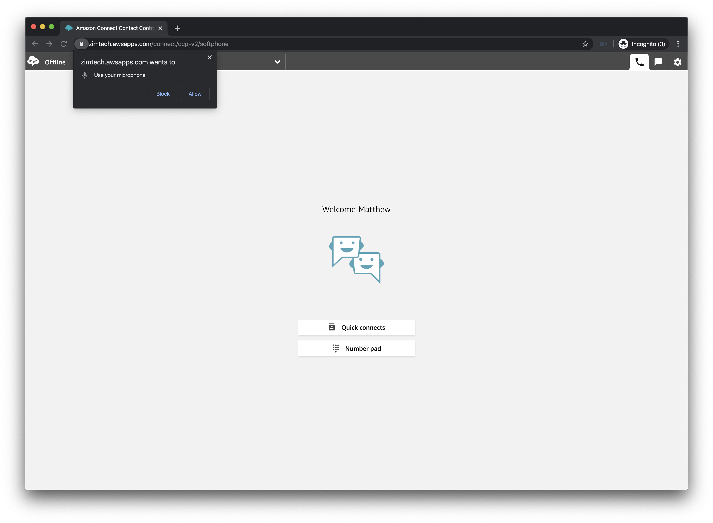
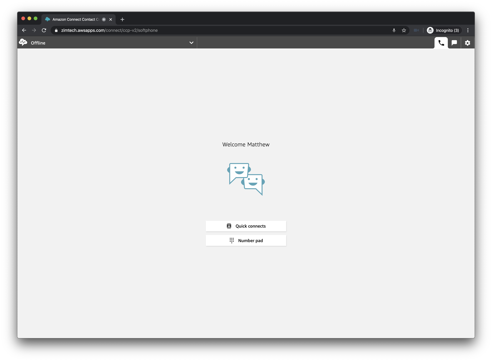
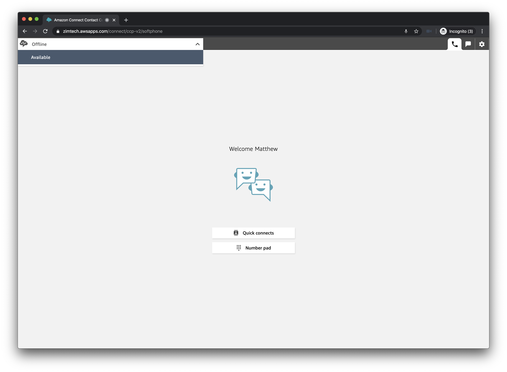
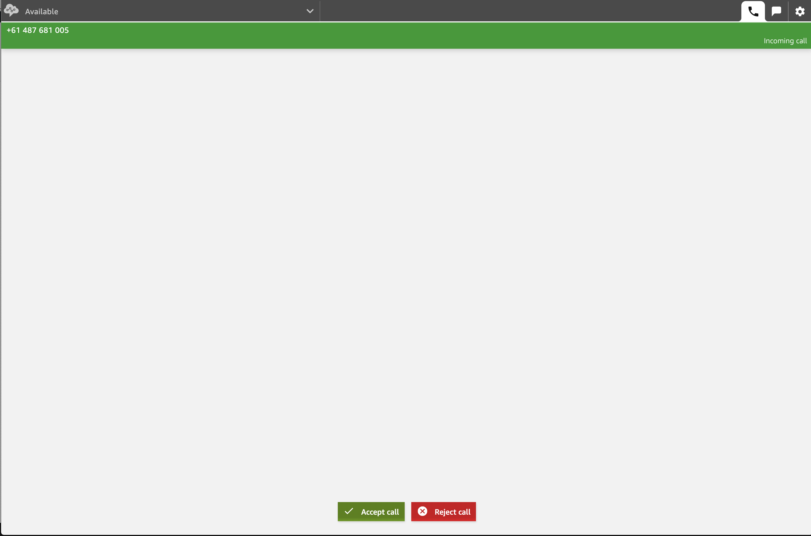

## Overview
And we are now ready to take our first call. is it exciting?

## Log into the CCP
1. In an incognito Browser window.... Open up the URL of your Contact Control Panel which is <b>https://%InstanceName%.awsapps.com/connect/ccp-v2</b> where %InstanceName% is the name your provided when originally provisioning your environment.

2. If successful you will be presented with a login page similar to the one when you first logged into the Connect Management Console.

3. Enter the Username and Password you used in the last section for our new Agent User and click <b>Login</b>.

4. As we are using our browser as a softphone you may be presented with a Security warning... Allow the use of your microphone by the webpage.

5. You are now logged into the Queue but set to offline which means you will not be taking any calls.

6. To change this, select <b>Available</b> from the dropdown menu at the top left of the page.

7. At this stage, you are now ready to take your first call. You can call yourself using a mobile phone or a VOIP client on your machine.

8. When you select Option 2 in your IVR, your call will land on your agent control panel. You can click <b>Accept Call</b> to answer and speak to the caller. BE CAREFUL OF FEEDBACK WHEN DIALING YOURSELF.

## Next Steps
And that's it, you have a contact centre that accepts calls and allows users to act as Agents. proceed to the <b>Summary</b> section by click the <b>next</b> button below or selecting it from the sidebar on the left.