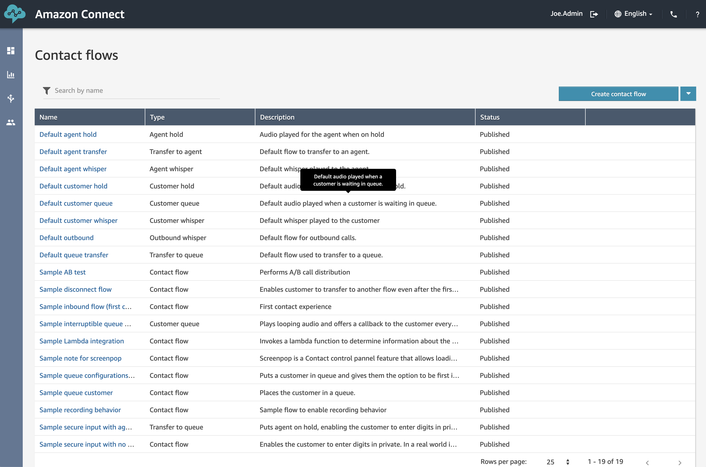
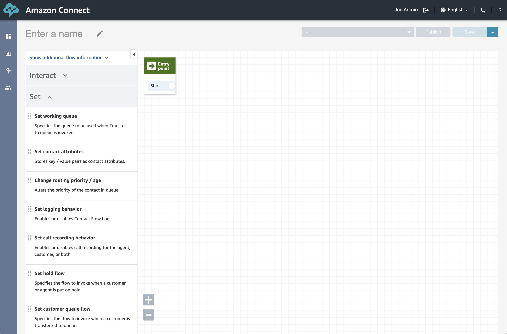

## Overview
And this is the section where we start having fun by creating our own Contact Flows. A contact flow defines the customer experience with your contact center from start to finish. Using these we can do things such as answer the incoming call, play audio recordings, transfer calls between queues and prompt the user for inputs (such as in traditional IVR solutions. "Press 1 for Sales, 2 for Support"). To start off with we will simply create a contact flow that answers an incoming call, play a message to the caller and then hang-up. In future sections we will add additinal functionality.

## Create our first Flow
1. From where we left off in the last section, go ahead and select <b>Contact Flows</b> from the <b>Routing</b> menu (third from the top).

2. Next, we want to create a new Contact Flow so go ahead and click <b>Create contact flow</b> from the top of the page.

Here we have the Contact Flow view and there are a couple of things we need to take a look at. On the left hand side is a list of items or actions that we can use within out contact flow (currently hidden by the menus). On the Right hand side is a gridded page much like a visio or Draw.io page and this is the surface we drag our actions into in order to to build a flow chart of how we want our calls to be handled. You can already see the green <b>Entry Point</b> which is where the call will come into our contact flow.

3. To get the call rolling we need to take the call from the <b>Begin Calls</b> action and do something with it. So in our case we'd first like to start some monitoring so that we will have something to refer to as we build out the flow. Click on the <b>Set</b> menu to expand the list of things we can set regarding the call.

The <b>Set</b> menu contains all of the things we can define about a call. I personally find it best to think of these things as "variables or Parameters" i'd like to set. You can see we can Set Flows and Queues, define recording behaviour etc.

4. For our use case we want to start logging information about the call, so we can go ahead and drag the <b>"Set logging behavior"</b> item from the <b>Set</b> list onto the screen like what's shown below.

Now we want to tell Amazon Connect that any calls that comes into this Flow show flow to this action first.

5. Drag a line from the "Start" point in the <b>"Entry Point"</b> to the left hand side of the <b>"Set logging behavior"</b> box, indicating a one way flow much like a flow chart would. 

Now that we have monitoring being enabled, the next step would be to play a message to our caller. For this we want to open up the <b>"Interact"</b> menu.

6. Select and drag the <b>"Play Prompt"</b> action onto the page, just to the right of the <b>"Set logging behavior"</b> action.

7. Much like we did for directing the call from the <b>"Entry Point to Logging"</b> actions, we need to do the same from <b>logging to play prompt</b>. For this we can drag a line from the <b>"Success"</b> outcome to the left hand side of the <b>"Play Prompt"</b>. 

8. Next, we want to define what the <b>"Play Prompt"</b> will actually.... play. To do this, simply click on the blue title of the object and a Setting page will appear from the right hand side of the page. Here we have several options around defining where we wish to pull our audio file from. Normally, you'd have a set of pre-recorded <b>"Prompts"</b> that you'd reuse throughout different parts of your Instance much the same way to re-use code. For our example, we will actually just define the Text we'd like Connect to say to our caller, so go ahead and select the <b>"Text-to-speech or chat text"</b> radio button.

We can now set a bunch of settings around how and where our text will come from and be read to the caller. We can define things dynamically off the back of variables we've set or Lambda functions we can call as well as tell Connect to interpret our response as Text or SSML. For the moment, we can simply have it read our text, but we will take a closer look at the SSML later in the workshop.

9. To keep things simple we will simply add some basic text that will be read to that caller. In the <b>"Text"</b> box, put a greeting you'd like read. For this example i've added "Thank you for calling Zimtech. Unfortunately nobody is currently available to take your call". Once you've added some text, go ahead and click <b>save</b> to return to the previous screen. 

So we have our call being answered, it enables the logging and then reads some text to the caller. The final thing we'll have it do at the moment is hang up the call. 

10. Go ahead and expand the <b>"Terminate/Transfer"</b> menu.

11. Under the <b>"Terminate/Transfer"</b> menu, go ahead and drag the <b>"Disconnect/Hang up"</b> action to the screen on the far right, like shown below.

12. Again, drag a connection between the <b>"Okay"</b> response from the Play Prompt to the left hand side of the final action. And there we have it, our first end to end Contact Flow.

13. You might have noticed that the same button is currently greyed out. To resolve this give your new Contact Flow a name (at the top left hand side of the page under <b>"Enter a name"</b>).

With a name, two button become available... <b>"Publish"</b> and <b>"Save"</b>. For this example we can go straight ahead to publishing our changes as there isn't a previous version in production that needs to be managed. Publishing the Contact Flow will enable us to assign it to a Phone Number so go ahead and click <b>"Publish"</b> and then again for the warning message that appears, just like as shown below.

## Next Steps
Next Step is to create a new Contact Flow to handle the incoming calls to your new <b>1800 XXX XXX</b> phone number. Click <b>Configure Inbound Calls</b> to move onto the next step of tasks.