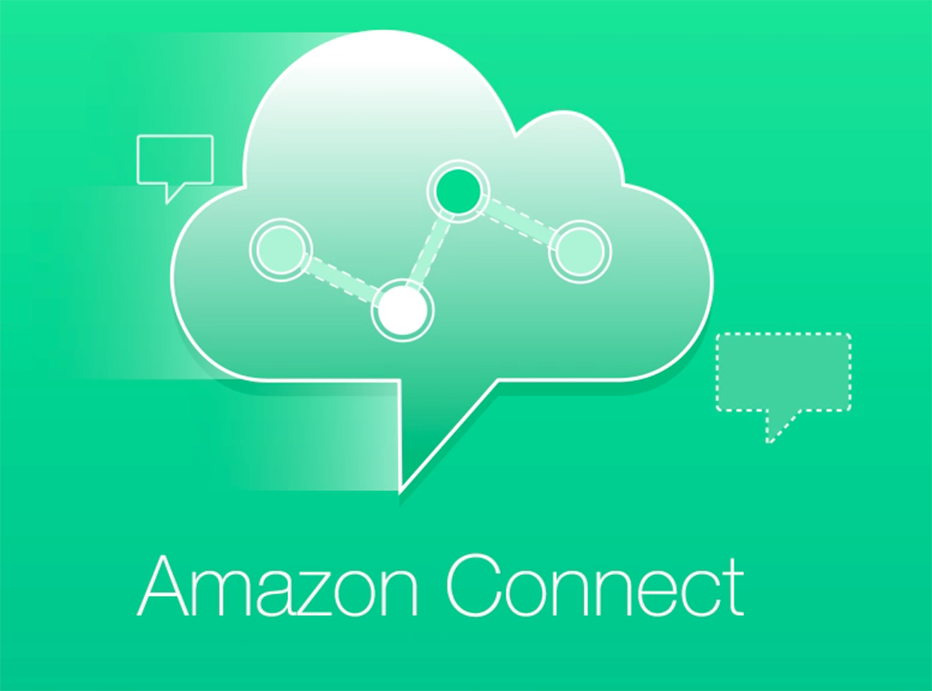

## Overview
The is the <b>Getting Started with Amazon Connect: Step 1 to a truly cognitive experience</b> workshop, the first in a series of workshops written by [Matthew Merriel](https://www.linkedin.com/in/matthewmerriel/). These Workshops are designed to build a readers skills around the Amazon Connect platform. 

This workshop was originally created for the [Melbourne AWS Programming and Tools Meetup](https://www.meetup.com/Melbourne-AWS-Programming-and-Tools-Meetup/).

This Workshop contains step by steps instructions and the required assets to help you build your first Amazon Connect solution. It is broken up into 6 key Parts, each containing instructions to get your first Contact Centre up and accepting calls.

| Part | Description |
|:---:|:---|
| <b>Introduction</b> | (This Page) provides an introduction and instructions on creating the required AWS environment. |
| <b>Connect Setup</b> | This Section outlines the steps required to setup your first Virtual Contact Centre Instance, responsible for hosting all your Contact Centre Components. |
| <b>First Inbound Flow</b> | Setting up our Connect Instance and allowing us to talk our first inbound call |
| <b>Validating our Logging</b> | In this part, we will validate our logging, Reporting and create Dashboards to visualize what our contact centre is doing. |
| <b>Adding Interactivity</b> | Next we can go ahead and add a chatbot to enable our callers to define what they are ringing for. |
| <b>Enabling Agents</b> | Finally, we will configure our agents who will be responsible for answering our calls. |

At the end of this Workshop you will have a fully functioning Amazon Connect solution capable of receiving inbound calls, interact with the caller through the use of Lex & polly and direct callers to the correct queues and agents. In future Amazon Connect Workshops, we will expand on this by adding Lambda functions, database lookups and predictive algorithms to provide our callers and agents with a seamless, reliable experience.

## What is Amazon Connect
Amazon Connect is an easy to use omnichannel cloud contact center that helps companies provide superior customer service at a lower cost. Over 10 years ago, Amazon’s retail business needed a contact center that would give our customers personal, dynamic, and natural experiences. We couldn’t find one that met our needs, so we built it. We've now made this available for all businesses, and today thousands of companies ranging from 10 to tens of thousands of agents use Amazon Connect to serve millions of customers daily.

Designed from the ground up to be omnichannel, Amazon Connect provides a seamless experience across voice and chat for your customers and agents. This includes one set of tools for skills-based routing, powerful real-time and historical analytics, and easy-to-use intuitive management tools – all with pay-as-you-go pricing, which means Amazon Connect simplifies contact center operations, improves agent efficiency, and lowers costs. You can set up a contact center in minutes that can scale to support millions of customers.

You can get find more information on Amazon Connect by visiting the Amazon Connect [Product Page](https://aws.amazon.com/connect).

## Account Preparation
in order to follow along with this workshop, you'll need to already have the following:
- <b>AWS Account</b> We will be using AWS as our Cloud provider. sign-up at https://aws.amazon.com if you don't already have one
- <b>IAM Account</b> to be able to interact with the Amazon Connect Instance.
- <b>Mobile or Soft Phone</b> As we will be creating an inbound contact flow you will need something capable of ringing of the provisioned DID

for the purposes of this workshop, we will be deploying all of our resources in the <b>ap-southeast-2</b> region.

<b>NOTE:</b> throughout this workshop we will be deploying resources that will generated costs against your AWS account. While all effort has been made to try and only use resources available under the AWS Free-Tier, some costs may be generated.

## Conclusion
You should now have your AWS account ready to deploy your Amazon Connect instance in as well as be using an IAM user with <b>"AmazonConnectFullAccess"</b> permissions. Once you have both of these in place, you can proceed to the "Introduction" stage of the workshop by clicking the link below or on the sidebar to the left.

