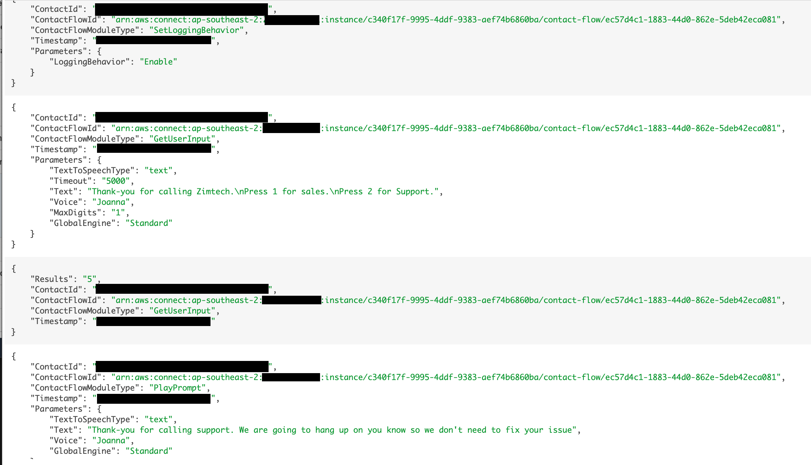

## Overview
In this section we will take a quick look at the types of information was can gain from CloudWatch including logs and metrics.

## Next Steps
To get started, proceed to the <b>Cloud Watch Logs</b> section by click the <b>next</b> button below or selecting it from the sidebar on the left.